# Curso ReactiveX

* [¿Qué es la programación reactiva?](#qué-es-la-programación-reactiva)
* [¿Qué es ReactiveX?](#que-es-reactive)
* [¿Cuándo usar Rx?](#cuándo-usar-rx)
* [¿Qué es RxJS?](#qué-es-rxjs)
* [Observables](#observables)    
    * [observables.next()](#observablesnext)
    * [observables.error()](#observableserror)
    * [observables.complete()](#observablescomplete)
    * [Subject](#subject)
    * [Cold Observable vs Hot Observable](#cold-observable-vs-hot-observable)
    * [of()](#of)
    * [from()](#from)
    * [fromEvent()](#fromevent)
    * [range()](#range)
    * [interval()](#interval)
    * [timer()](#timer)
    * [Buenas prácticas con Observables](#buenas-prácticas-con-observables)
* [Observer](#observer)
* [Scheduler](#scheduler)
    * [Tipos de Scheduler](#tipos-de-scheduler)
    * [asyncScheduler](#asyncscheduler)
* [Subscribers](#subscribers)
    * [Tipos de Scheduler](#tipos-de-scheduler)
* [Operators](#operators)  
    * [Encadenar operadores](#encadenar-operadores)
    * [pipe()](#pipe)
    * [map()](#map)
    * [pluck()](#pluck)
    * [mapTo()](#mapto)
    * [filter()](#filter)
    * [tap()](#tap)
    * [reduce()](#reduce)
    * [scan()](#scan)
    * [first()](#first)
    * [take()](#take)
    * [takeWhile()](#takewhile)
    * [takeUntil()](#takeuntil)
    * [skip()](#skip)
    * [distinct()](#distinct)
    * [distinctUntilChanged()](#distinctuntilchanged)
    * [distinctUntilKeyChanged()](#distinctuntilkeychanged)
    * [debounceTime()](#debouncetime)
    * [throttleTime()](#throttletime)
    * [sampleTime()](#sampletime)
    * [sample()](#sample)
    * [auditTime()](#audittime)
    * [catchError()](#catcherror)


## ¿Qué es la programación reactiva?
Es un paradigma de la programación declarativa funcional relacionada con el tratamiento de flujos de datos (data streams) y la propagación de los cambios.

## ¿Qué es ReactiveX?
ReactiveX es una biblioteca de software creada originalmente por Microsoft que permite que los lenguajes de programación imperativos operen en secuencias de datos sin importar si los datos son sincrónicos o asincrónicos.


## ¿Cuándo usar Rx?
* Al momento de manejar eventos de la interfaz de usuario
* Cuando es necesario notificar sobre cambios de uno o varios objetos
* Comunicación por Sockets
* Cuando necesitamos trabajar con flujos de información **(Streams)**

## ¿Qué es RxJS?
RxJS es la adaptación a JS (JavaScript) del conjunto de herramientas de ReactiveX, está desarrollada para diversos lenguajes como C++ (RxCpp), C# (Rx.NET), o PHP (RxPHP) entre otros.

## Observables
Son la pieza fundamental de las extensiones reactivas. En lugar de manejar los eventos de manera imperativa, los `Observables` ofrecen una forma declarativa de tratar con secuencias de eventos y datos asíncronos. Entre sus características principales tenemos:
* Son la fuente de información.
* Pueden emitir múltiples valores, sólo uno o ninguno.
* Pueden emitir errores.
* Pueden ser finitos o infinitos.
* Pueden ser síncronos o asíncronos.

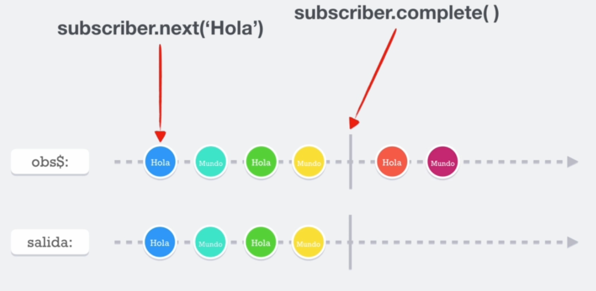

Un observable tiene la capacidad de emitir o no un valor, para instanciar un observable basta con importar la librería e iniciarlo con el método `create` o con `new Observable<tipo_de_dato>()`, en TS en caso de no colocar el tipo de dato, el lenguaje interpretará que es de tipo `any`
```ts
import { Observable } from "rxjs";

// const obs$ = Observable.create();
const obs$ = new Observable<string>();
```
> **Nota**: el método `create` se encuentra deprecated desde la v7 de rxjs y sera eliminado en la v8.

Un método facil de identificar cuando es un observable es que se importa directamente de rxjs `import { ... } from "rxjs";`

### observables.next()
Las notificaciones "Next" son las más importantes, y las más comunes ya que representan los datos que se envían al suscriptor. Las mismas deben ser del tipo de dato indicado en caso de trabajar con un lenguaje de tipado o puede ser nulas.

```ts
import { Observable } from "rxjs";

// const obs$ = Observable.create();
const obs$ = new Observable(subs => {
    subs.next('test');
    subs.next('hola');
});

obs$.subscribe(console.log);
```

### observables.error()
El método `error()` no es más que un controlador para notificar de un error. Un error detiene la ejecución de la instancia observable y cancela la suscripción.

```ts
import { Observable } from "rxjs";
const obs$ = new Observable<string>(subs => {
    // Forzando un error
    const a = undefined;
    a.nombre = 'Fernando'
    console.log('1');
    subs.complete();
});

obs$.subscribe({ 
    next: next => console.log('Next: ', next), 
    error: error => console.warn('Error: ', error), 
    complete: () => console.log('COMPLETE')
});

```
En este ejemplo forzamos un error donde se mostrará por consola el siguiente mensaje

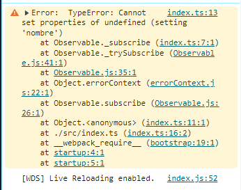


### observables.complete()
El método `complete()` no es más que un controlador para notifica que la ejecución fue completada.

```ts
import { Observable } from "rxjs";

// const obs$ = Observable.create();
const obs$ = new Observable(subs => {
    subs.next('test');
    subs.next('hola');
    subs.complete();
});

obs$.subscribe(console.log);

```
Una vez colocado aunque se emitan valores los mismos no llegarían a sus subscriptores. En el ejemplo de a continuación los valores test y hola se emite, pero los número 2 y 3 no lo harán

```ts
import { Observable } from "rxjs";

// const obs$ = Observable.create();
const obs$ = new Observable(subs => {
    subs.next('test');
    subs.next('hola');
    subs.complete();
    subs.next('2');
    subs.next('3');
});

obs$.subscribe(console.log);
```

### Subject
Un `Subject` es una especie de puente entre los observables (emisores) y los Observers (suscriptores) de un flujo de datos. Tiene las caracteristicas de:
* Permite el casto múltiple.
* Es un observer
* Tiene las propiedades Next, Error y Complete

Un `Subject` es, en sí mismo, un observable que puede emitir valores, pero también es un objeto que puede ser utilizado para suscribirse a los eventos emitidos. 
```ts
import { Observable, Observer, Subject, Subscription } from "rxjs";

const intervalo$ = new Observable<number>(subs => {
    const intrv = setInterval(() => { subs.next(Math.random()) }, 1000)
    return () => {
        clearInterval(intrv);
        console.log('completado');        
    }
})

const subsject$ = new Subject();

const subsjectSubject$ = intervalo$.subscribe(subsject$);

const subs1 = subsject$.subscribe(console.log);
const subs2 = subsject$.subscribe(console.log);

setTimeout(() => {
    subsject$.next(10);
    subsject$.complete();
    subsjectSubject$.unsubscribe();
}, 3500);
```

En este ejemplo nos estámos subscribiendo al observable `intervalo$` y emitimos valores con `subsject$.next(10);`

### Cold Observable vs Hot Observable
Cuando la data es producida por el observable en sí mismo, es considerado un `Cold Observable`. Pero cuando la data es producida fuera del observable es llamado `Hot Observable`

```ts
import { Observable, Observer, Subject, Subscription } from "rxjs";

const intervalo$ = new Observable<number>(subs => {
    const intrv = setInterval(() => { subs.next(Math.random()) }, 1000)
    return () => {clearInterval(intrv)}
})

const subsject$ = new Subject();

intervalo$.subscribe(subsject$);

const subs1 = subsject$.subscribe(console.log);
const subs2 = subsject$.subscribe(console.log);

setTimeout(() => {
    subsject$.next(10);
    subsject$.complete();
}, 3500);
```
La respuesta por consola de este código por consola sería

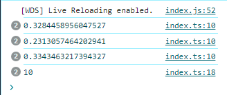

Acá podemos apreciar un buen ejemplo del `Hot Observable` ya que logramos insertar información al usando el `subsject$.next(10)` al flujo de datos que el observable `intervalo$` estaba emitiendo.


### of()
El operador `of()` es una función que toma como parámetro una secuencia de elementos y devuelve un observable que emite cada elemento de la secuencia tal cual como se recibió, tiene la particularidad que emite sincrónicamente los argumentos descritos y luego se completa inmediatamente.

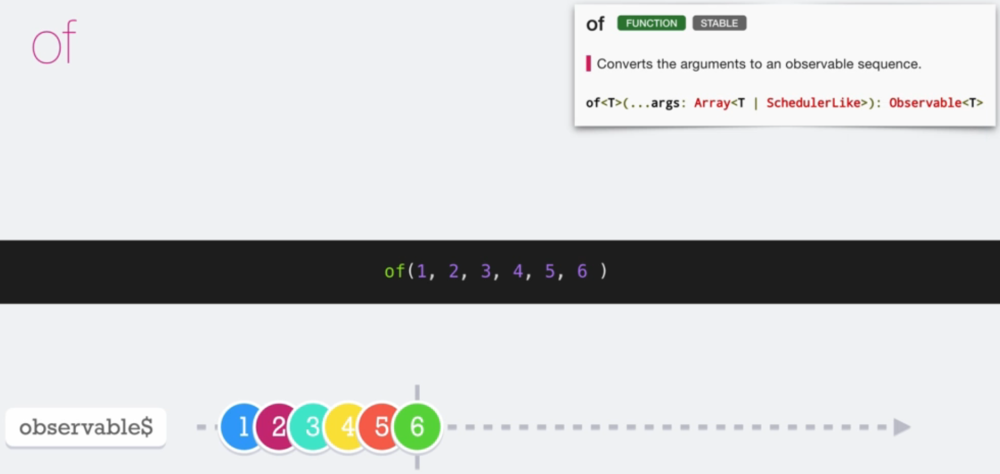

Es importante tomar en consideración que los valores enviamos deben estar separados por comas (,) a fin que detecte que son elementos diferentes. La nomenclatura usada sería `of<tipo-valor>(valor1, valor2, valor3);`
```ts
import { of } from "rxjs";

const obs$ = of(1,2,3,4,5,6);

obs$.subscribe({
    next: next => console.log('Next: ', next),
    error: error => console.warn('Error: ', error),
    complete: () => console.log('Terminamos la secuencia')
})

const obs2$ = of([1,2,3,4,5,6]);

obs2$.subscribe({
    next: next => console.log('Next: ', next),
    error: error => console.warn('Error: ', error),
    complete: () => console.log('Terminamos la secuencia')
})
```
En el anterior ejemplo vemos como `obs$` responde con 6 diferentes elementos númericos mientras que `obs2$` nos responde un solo elemento de tipo array

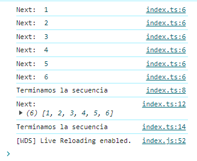

### from()
El operador `from()` es una función que crea un Observable a partir de una Array, Objeto, Promesa, iterable o un Observable.

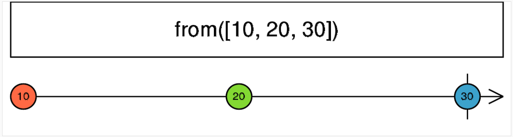

La nomenclatura usada sería `from<tipo-valor>(target, eventName);`.
```ts
import { of, from, Observer } from "rxjs";

const fromObserver: Observer<any> = {
    next: next => console.log('fromObserver Next: ', next), 
    error: error => console.warn('Error: ', error), 
    complete: () => console.log('fromObserver COMPLETE')
}

const source$ = from([1,2,3,4,5]);

source$.subscribe(fromObserver);
```
La respuesta de este código sería

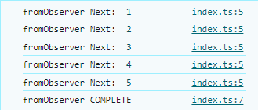

El observable `from` y el `of` generan distintas respuestas al pasarles un argumento como un string
```ts
import { of, from, Observer } from "rxjs";

const fromObserver: Observer<any> = {
    next: next => console.log('fromObserver Next: ', next), 
    error: error => console.warn('Error: ', error), 
    complete: () => console.log('fromObserver COMPLETE')
}

const ofObserver: Observer<any> = {
    next: next => console.log('ofObserver Next: ', next), 
    error: error => console.warn('Error: ', error), 
    complete: () => console.log('ofObserver COMPLETE')
}

const source2$ = from('Fernando');
const source3$ = of('Fernando');

source2$.subscribe(fromObserver);
source3$.subscribe(ofObserver);
```
Por consola veríamos esta respuesta

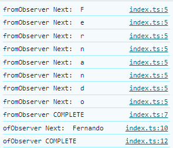

El `from()` también permite trabajar con promesas

```ts
import { of, from, Observer } from "rxjs";

const observer: Observer<any> = {
    next: next => console.log('fromObserver Next: ', next), 
    error: error => console.warn('Error: ', error), 
    complete: () => console.log('fromObserver COMPLETE')
}

const source2$ = from(fetch("https://api.github.com/users/klerith"));

source2$.subscribe( async(res) => {
    const data = await res.json()
    console.log(data);
})

source2$.subscribe(observer)
```
En este caso usamos una petición `fetch` propia de JS para realizar la promesa la cual nos trae la siguiente respuesta

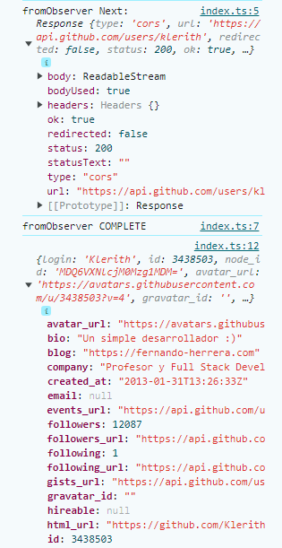

El observable `from()`, nos permitirá recorrer iterables similar a un bucle for aunque se diferencia de este ya que en vista que la respuesta es un observable se podra usar distintos Operadores para poder adaptar el response resultante

```ts
import { of, from, Observer } from "rxjs";

const observer: Observer<any> = {
    next: next => console.log('fromObserver Next: ', next),
    error: error => console.warn('Error: ', error),
    complete: () => console.log('fromObserver COMPLETE')
}

const miGenerador = function* () {
    yield 1;
    yield 2;
    yield 3;
    yield 4;
    yield 5;
}

const miIterable = miGenerador();

for (let id of miIterable) {
    console.log(id);
}

from(miIterable).subscribe(observer);
```


### fromEvent()
El operador `fromEvent()` es una función que crea un Observable que emite eventos de un tipo específico, originados en el *event target* proporcionado. Un *event target* es un objeto con métodos para registrar las funciones de manejo de eventos.

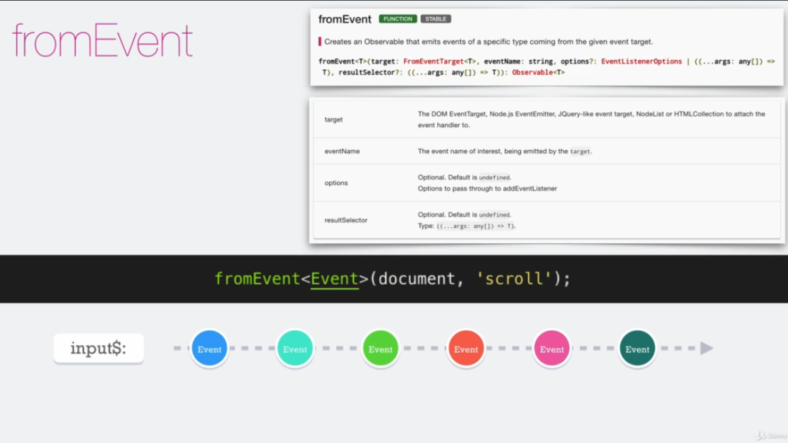

Un ejemplo del uso del `fromEvent` es cuando deseamos escuchar eventos propios del DOM, en este caso escucharemos los eventos del `click` y del `keyup`.
La nomenclatura usada sería `fromEvent<tipo-valor>(target, eventName);`

```ts
import { Observer, fromEvent } from "rxjs";

const src1$ = fromEvent<PointerEvent>( document, 'click');
const src2$ = fromEvent<KeyboardEvent>( document, 'keyup');

const observer: Observer<any> = {
    next: next => console.log('Next: ', next),
    error: error => console.warn('Error: ', error),
    complete: () => console.log('Terminamos la secuencia')
}

src1$.subscribe(observer);
src2$.subscribe(event => {
    console.log(event.key);
});
```

### range()
La función `range()` crea un Observable que emite una secuencia de números dentro de un rango. Por default esta función es sincrona

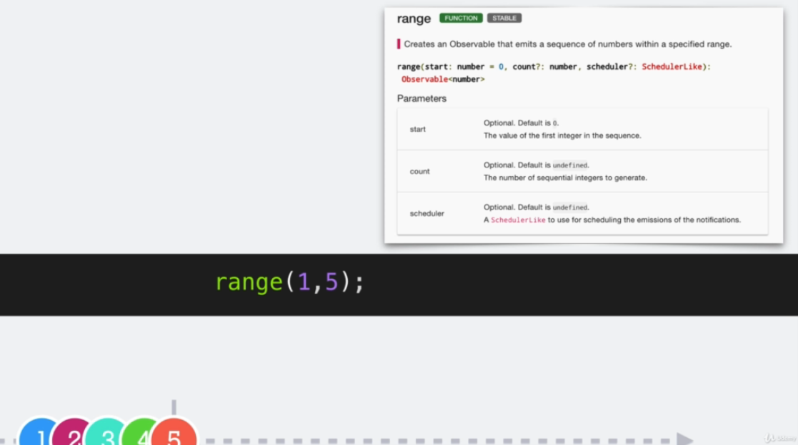

La función `range()` posee la siguiente nomenclatura `range(start: number, count?: number, scheduler?: SchedulerLike): Observable<number>`, donde si solo se coloca un valor indicará la cantidad de emisiones iniciando en el `valor 0`.
* **start:** El valor del primer número entero de la secuencia.
* **count:** El número de enteros secuenciales que se generarán.
* **scheduler:** Es un SchedulerLike que se utiliza para programar las emisiones de las notificaciones. Esto puede permitir modificar la función de sincrona a asincrona

```ts
import { asyncScheduler, range } from "rxjs";

const src$ = range(3);
const src2$ = range(5,3);
const src3$ = range(5,3, asyncScheduler);

console.log('Inicio src$');
src$.subscribe(console.log)
console.log('Fin src$');


console.log('Inicio src2$');
src2$.subscribe(console.log)
console.log('Fin src2$');

console.log('Inicio src3$');
src3$.subscribe(console.log)
console.log('Fin src3$');
```
La respuesta de este ejemplo daría

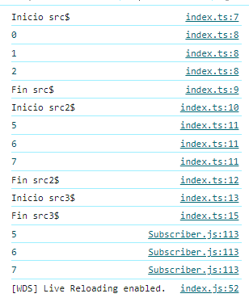


### interval()
La función `interval()` crea un Observable que emite una secuencia de números incremental, con el intervalo de tiempo entre emisiones que se especifique. Por default esta función es asincrona

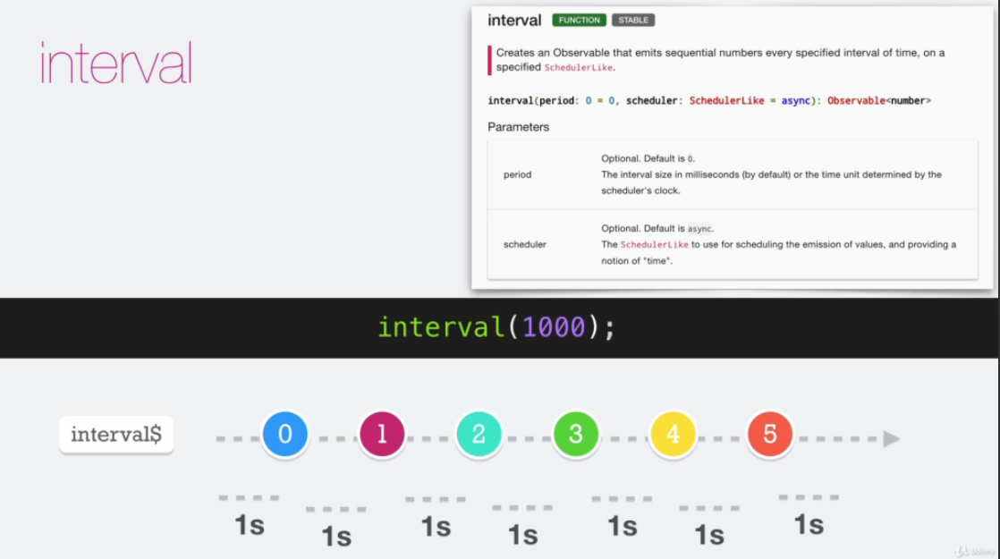

La función `interval()` posee la siguiente nomenclatura `interval(period: number = 0, scheduler: SchedulerLike = async): Observable<number>`, 

* **period:** El valor por defecto es `0`. El tamaño del intervalo en milisegundos (por defecto) o en la unidad de tiempo determinada por el reloj del planificador.
* **scheduler:** Es un SchedulerLike, el valor por defecto es `async`. El SchedulerLike que se utiliza para planificar la emisión de valores y para proporcionar la noción del "tiempo".

```ts
import { Observer, interval } from "rxjs";

const observer: Observer<number> = {
    next: next => console.log('Next: ', next),
    error: error => console.warn('Error: ', error),
    complete: () => console.log('COMPLETE')
}

const interval$ = interval(1000);

console.log('inicio');
interval$.subscribe(observer)
console.log('fin');
```
La respuesta de este ejemplo daría

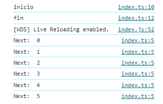


### timer()
La función `timer()` crea un Observable que comienza a emitir una secuencia ascendente de números consecutivos a intervalos, tras un periodo inicial de tiempo. Por default esta función es asincrona

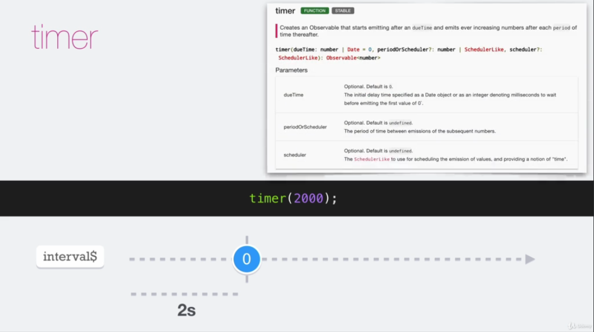

La función `timer()` posee la siguiente nomenclatura `timer(dueTime: number | Date = 0, periodOrScheduler?: number | SchedulerLike, scheduler?: SchedulerLike): Observable<number>`, 

* **dueTime:** El valor por defecto es `0`. El valor del retraso inicial que esperar antes de emitir el primer valor, especificado como objeto Date o como Integer, en milisegundos.
* **periodOrScheduler:** El valor por defecto es `undefined`. El periodo de tiempo entre emisiones.
* **scheduler:** Es un SchedulerLike, El valor por defecto es `undefined`. EL SchedulerLike que utilizar para planificar las emisiones, proporcionando la noción de 'tiempo'.

```ts
import { Observer, timer } from "rxjs";

const observer: Observer<number> = {
    next: next => console.log('Next: ', next),
    error: error => console.warn('Error: ', error),
    complete: () => console.log('COMPLETE')
}

const timer$ = timer(2000);
const timer2$ = timer(3000, 1000);

const today = new Date();
today.setSeconds(today.getSeconds() + 6)

const timer3$ = timer(today);


console.log('inicio timer$');
timer$.subscribe(observer)
console.log('fin timer$');

console.log('inicio timer2$');
timer2$.subscribe(observer)
console.log('fin timer2$');

console.log('inicio timer3$');
timer3$.subscribe(observer)
console.log('fin timer3$');
```

La respuesta de este ejemplo daría

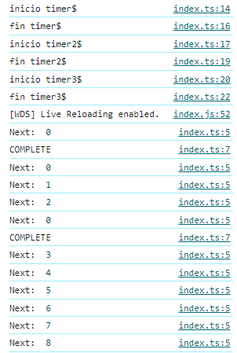

Como se puede apreciar en el `timer$` fue completado al pasar 2 segundos, por su parte el `timer2$` empezó a generar intervalos de tiempo a partir de los 3 segundos cada 1 seg, por último el timer3$ realizó su única ejecución a los 6 segundos y completo instantaneamente.


### Buenas prácticas con Observables
* **Nomenclatura de variables:** Es recomendable identificar un `Observable` con una variable la cual lleve al final de la misma un simbolo de dolar, por ejemplo **`clicks$`**.
* **Utiliza tipado fuerte:** Es recomendable especificar el tipo de datos emitidos por el Observable utilizando tipos fuertemente tipados.
* **Evita la creación innecesaria de Observables:** En lugar de crear nuevos Observables para cada operación, intenta encadenar operadores en un solo Observable utilizando tuberías (pipes). 
* **Utiliza el operador `pipe`:** El operador pipe permite encadenar múltiples operadores para transformar, filtrar o combinar los datos emitidos por el Observable.
* **Desuscribe adecuadamente:** Si te suscribes a un Observable, asegúrate de desuscribirte cuando ya no necesites recibir más datos.
* **Evita el uso de `any`:** En la medida de lo posible, evita utilizar el tipo any para los datos emitidos por los Observables.
* **Utiliza operadores de error:** Los Observables proporcionan operadores como `catchError` y `retry` para manejar errores de manera más robusta.
* **Separación de responsabilidades:** Separa las operaciones de los Observables en diferentes funciones o servicios.
* **Documenta tus Observables:** Añade comentarios o documentación que explique la finalidad y el comportamiento de los Observables que estás utilizando.

## Observer
Un `Observer` o `Observador` es aquel que se subscribe a un `Observable`, basicamente es un consumidor de los valores emitidos por un Observable. Los Observadores son simplemente conjuntos de callbacks, una para cada tipo de notificación entregada por el Observable: next, error y complete. El observador reaccionará a cualquier elemento o secuencia de elementos que emita el Observable. A continuación vemos un ejemplo de un objeto Observador clásico:

```ts
const observer = {
  next: (x) => console.log("El Observador ha recibido un valor next: " + x),
  error: (err) => console.error("El Observador ha recibido un error: " + err),
  complete: () =>
    console.log("El Observador ha recibido una notificación de compleción"),
};
```

Para utilizar el Observador, se le provee al `subscribe` de un Observable:
```ts
observable.subscribe(observer);
```
> Nota: *Los Observadores son objetos con tres callbacks, una para cada tipo de notificación que un Observable puede emitir.*

Los Observadores en RxJS pueden ser parciales. Aunque no se proporcione una de las *callbacks*, la ejecución del Observable ocurrirá de forma normal, excepto por el hecho de que algunos tipos de notificaciones se ignorarán, ya que carecen de la callback correspondiente en el Observador.

El ejemplo visto a continuación muestra un Observador sin la callback complete:

```ts
const observer = {
  next: (x) => console.log("El Observador ha recibido un valor next: " + x),
  error: (err) => console.error("El Observador ha recibido un error: " + err),
};
```

Al realizar la suscripción a un Observable, también se pueden proporcionar las callbacks como argumentos, sin tener que estar vinculadas a un objeto Observador. Por ejemplo:

```ts
observable.subscribe((x) =>
  console.log("El Observador ha recibido un valor next: " + x)
);
```

Internamente en observable.subscribe, se creará un objeto Observador utilizando el primer argumento callback como el manejador next. Los tres tipos de callbacks pueden proporcionarse como argumentos:
> Nota: ~~Foma de callbacks actualmente en desuso~~.
```ts
observable.subscribe(
  (x) => console.log("El Observador ha recibido un valor next: " + x),
  (err) => console.error("El Observador ha recibido un error: " + err),
  () => console.log("El Observador ha recibido una notificación de compleción")
);
```


## Scheduler
Un `Scheduler` o `Planificador` controla cuándo comienza una suscripción, y cuándo se envían las notificaciones. Está compuesto por tres componentes:

* **Un Scheduler es una estructura de datos.** Sabe cómo almacenar y poner tareas a la cola basándose en la prioridad u otro criterio.
* **Un Scheduler es un contexto de ejecución.** Denota dónde y cuándo se ejecuta una tarea (ej: inmediatamente, o mediante otro mecanismo de callback tal como setTimeout, process.nextTick o el Animation frame.)
* **Un Scheduler tiene un reloj (virtual).** Este proporciona la noción de "tiempo" mediante un método de acceso now() en el Planificador. Las tareas que se planifican con un Planificador particular se adherirán únicamente a la noción de tiempo proporcionada por su reloj.

> Nota: Un `Scheduler` permite definir en qué contexto de ejecución se enviarán las notificaciones de un Observable a su Observador.

En el ejemplo mostrado a continuación, se parte del ejemplo simple de un Observable que emite los valores 1, 2 y 3 de forma síncrona, y se utiliza el operador `observeOn` para especificar que el Planificador `async` será utilizado para enviar esos valores.

```ts
import { Observable, asyncScheduler } from "rxjs";
import { observeOn } from "rxjs/operators";

const observable = new Observable((observer) => {
  observer.next(1);
  observer.next(2);
  observer.next(3);
  observer.complete();
}).pipe(observeOn(asyncScheduler));

console.log("Justo antes de subscribe");
observable.subscribe({
  next(x) {
    console.log("Obtenido valor " + x);
  },
  error(err) {
    console.error("Ha ocurrido algo : " + err);
  },
  complete() {
    console.log("Completado");
  },
});
console.log("Justo después de subscribe");
// Salida
/**
    Justo antes de subscribe
    Justo después de subscribe
    Obtenido valor 1
    Obtenido valor 2
    Obtenido valor 3
    Completado
*/
```
Nótese que las notificaciones `Obtenido valor...` se enviaron después de `Justo después de subscribe`. Este comportamiento es distinto al comportamiento por defecto que hemos podido ver hasta ahora. Esto es debido a que `observeOn(asyncScheduler)` introduce un Observador proxy entre `new Observable` y el Observador final. Se pueden renombrar los identificadores para hacer que esta distinción sea obvia, como podemos ver en el siguiente código:

```ts
import { Observable, asyncScheduler } from "rxjs";
import { observeOn } from "rxjs/operators";

const observable = new Observable((proxyObserver) => {
  proxyObserver.next(1);
  proxyObserver.next(2);
  proxyObserver.next(3);
  proxyObserver.complete();
}).pipe(observeOn(asyncScheduler));

const finalObserver = {
  next(x) {
    console.log("Obtenido valor " + x);
  },
  error(err) {
    console.error("Ha ocurrido algo: " + err);
  },
  complete() {
    console.log("Completado");
  },
};

console.log("Justo antes de subscribe");
observable.subscribe(finalObserver);
console.log("Justo después subscribe");
```
El `proxyObserver` se crea en `observeOn(asyncScheduler)`, y su función `next(val)` es aproximadamente la que vemos a continuación:

```ts
const proxyObserver = {
  next(val) {
    asyncScheduler.schedule(
      (x) => finalObserver.next(x),
      0 /* Retardo */,
      val /* Será la x para la función anterior */
    );
  },

  // ...
};
```
El Planificador `async` opera con un `setTimeout` o `setInterval`, aunque el `delay` proporcionado sea cero. Como es habitual en JavaScript, `setTimeout(fn, 0)` ejecuta la función `fn` lo más pronto posible en la siguiente iteración del bucle de eventos. Esto explica por qué `Obtenido valor 1` se envía al `finalObserver` después de que ocurra `Justo después de subscribe.`

El método `schedule()` de un Planificador recibe un argumento `delay`, que se refiere a la cantidad de tiempo relativo al reloj interno propio del Planificador. El reloj del Planificador no tiene por qué tener relación alguna al tiempo de un reloj tradicional. Así es como los operadores temporales como `delay` operan según el tiempo dictaminado por el reloj del Planificador, en lugar de según el tiempo real. Esto es especialmente útil a la hora de hacer tests, ya que puede utilizarse un Planificador de tiempo virtual para falsificar el tiempo real, mientras se ejecutan tareas planificadas de forma síncrona.

### Tipos de Scheduler
El Scheduler `async` es uno de los Scheduler que proporciona RxJS. Cada uno de estos Scheduler se puede crear y retornar mediante las propiedades estáticas del objeto `Scheduler`.

|       Planificador      	|                                                                                                                Función                                                                                                               	|
|:-----------------------:	|:------------------------------------------------------------------------------------------------------------------------------------------------------------------------------------------------------------------------------------:	|
| null                    	| Si no se proporciona un planificador, las notificaciones se emiten de forma síncrona y recursiva. Se debe utilizar para operaciones de tiempo constante u operaciones recursivas lineales finales.                                   	|
| queueScheduler          	| Planifica en una cola en el **event frame** actual (planificador trampolín.) Se debe utilizar para operaciones de iteración.                                                                                                         	|
| asapScheduler           	| Planifica en la cola de **micro task**, que es la misma cola que se utiliza para las promesas. Básicamente se planifica después de la tarea actual, pero antes de la siguiente tarea. Se debe utilizar para conversiones asíncronas. 	|
| asyncScheduler          	| Planifica tareas con setInterval. Se debe utilizar para operaciones basadas en el tiempo.                                                                                                                                            	|
| animationFrameScheduler 	| Planifica una tarea que ocurrirá justo antes del siguiente repintado del contenido del navegador. Se puede utilizar para crear animaciones más fluidas en el navegador.                                                              	|


### asyncScheduler
La propiedad `asyncScheduler` es un `Scheduler` que permite programar la tarea como si usara `setTimeout (tarea, duración)`, aunque también tiene la capacidad de trabajar como  un `setInterval(tarea, duración)`. El `asyncScheduler` NO crea un observable, sino que crea un `Subscribers` (Suscripción). La nomenclatura del `asyncScheduler.schedule(tarea, tiempo, estado?);`

```ts
import { asyncScheduler } from "rxjs";
setTimeout(() => { }, 1000);

const saludar = () => console.log('Hola Mundo');
const saludar2 = nombre => console.log(`Hola Mundo ${nombre}`);

asyncScheduler.schedule(saludar, 2000)
asyncScheduler.schedule(saludar2, 2000, 'Fernando')

```

Para crear un intervalo es basta con hacer cambiar el estado del `schedule`, en este caso usaremos `this.schedule(state + 1, 1000)` el cual cambiará el estado cada 1 seg. Es importante recordar que el `asyncScheduler` es una suscripción por lo que para cancelar la misma se debe cancelar la misma.


```ts
import { asyncScheduler } from "rxjs";
setInterval(() => { }, 1000)

const sub = asyncScheduler.schedule(function (state) {
    console.log('state', state);    
    this.schedule(state + 1, 1000);
},3000, 0)

setTimeout(() => {
    sub.unsubscribe();
}, 6000);

```


## Subscribers
Un `Subscribers` o `Suscripción` es un objeto que representa un recurso desechable, normalmente la ejecución de un Observable. Las Suscripciones tienen un método importante, `unsubscribe`, que no recibe ningún argumento y se encarga de deshacerse del recurso mantenido por la Suscripción, bien se puede considerar como un método para conectarte a un **[Observable](#observables)**. Entre sus características principales tenemos:

* Se subscriben a un observable, es decir están pendiente de lo que realiza un observable.
* Consumen / observan la data que proviene del observable
* Pueden recibir los errores y eventos del observable
* Desconocen todo lo que se encuentra detrás del observable, es decir, la data puede haber sido previamente filtrada por algún **Operador** pero ellos lo desconocerán.

Para subscribirse a un Observable basta con usar el método `subscribe`

```ts
import { interval } from "rxjs";

const observable = interval(1000);
const subscription = observable.subscribe((x) => console.log(x));
/* 
 Después:
 Esto cancela la ejecución del Observable que 
 comienza al hacer una llamada subscribe con un Observador.
*/
subscription.unsubscribe();
```
> *Una Suscripción contiene una función unsubscribe() para desechar recursos o cancelar ejecuciones de Observables.*

Las suscripciones también pueden unirse, de manera que una llamada a la función unsubscribe() de una suscripción pueda cancelar múltiples suscripciones. Se puede lograr esto al "añadir" una suscripción a otra:

```ts
import { interval } from "rxjs";

const observable1 = interval(400);
const observable2 = interval(300);

const subscription = observable1.subscribe((x) => console.log("first: " + x));
const childSubscription = observable2.subscribe((x) =>
  console.log("second: " + x)
);

subscription.add(childSubscription);

setTimeout(() => {
  // Cancela AMBAS suscripciones: subscription y childSubscription
  subscription.unsubscribe();
}, 1000);

/*
Salida:

second: 0
first: 0
second: 1
first: 1
second: 2
*/
```

Las Suscripciones también tienen un método `remove(otherSubscription)`, para poder deshacernos de las Suscripciones hijas que se añadan.


### PartialObserver
Las subscripciones reciben pueden recibir varios tipos de datos entre los que tenemos los `PartialObserver`, para usarlos basta con importar `Observer` de `rxjs` y colocar los flujos `next`, `error` y `complete`

```ts
import { Observable, Observer } from "rxjs";

const obs$ = new Observable<string>(subs => {
    subs.next('test');
    subs.next('hola');

    // Forzando un error
    // const a = undefined;
    // a.nombre = 'Fernando'
    subs.complete();
});

const observer: Observer<any> = {
    next: next => console.log('Next: ', next), 
    error: error => console.warn('Error: ', error), 
    complete: () => console.log('COMPLETE')
}

obs$.subscribe(observer);
```

### unsubscribe()
Es una función para liberar recursos o cancelar ejecuciones de un observable, basta con usar el método `unsubscribe()` posterior a la subscripción

```ts
import { Observable, Observer } from "rxjs";

const obs$ = new Observable<string>(subs => {
    subs.next('test');
    subs.next('hola');
    subs.complete();
});

const observer: Observer<any> = {
    next: next => console.log('Next: ', next), 
    error: error => console.warn('Error: ', error), 
    complete: () => console.log('COMPLETE')
}

const sub = obs$.subscribe(observer);
sub.unsubscribe();
```

> **Nota**: Que un recursos cancele la suscripción no implica necesariamente que el observable se detenga.

En caso de tener varias subscripciones y deseamos detenerlas todas en cadena podemos usar el método `add()` para añadir una suscripción a una variable global y posteriormente cancelar dicha suscripción.

```ts
import { Observable, Observer, Subscription } from "rxjs";

const observer: Observer<any> = {
    next: next => console.log('Next: ', next), 
    error: error => console.warn('Error: ', error), 
    complete: () => console.log('COMPLETE')
}

const intervalo$ = new Observable<number>( subs => {

    let count = 0
    // Crear un contador, 1, 2, 3, 4, 5, .....
    const int = setInterval ( () => {
        // cada segundo
        count++;
        subs.next(count)
    }, 1000)

    return () => {
        clearInterval(int);
        console.log('Intervalo destruido');
    }
})

const sub = intervalo$.subscribe (observer);
const sub2 = intervalo$.subscribe (observer);
const sub3 = intervalo$.subscribe (observer);

const allSubs = new Subscription()
allSubs.add(sub);
allSubs.add(sub2);
allSubs.add(sub3)

setTimeout(() => {
    allSubs.unsubscribe();
    console.log('Completado');    
}, 6000);

```

Este código retornará por consola. Demostrando como después del intervalo de los 6 segundos las suscripciones se detienen


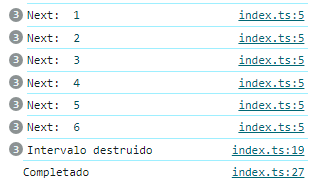


## Operators
Los operadores son funciones que construyen sobre la fundación de los observables para tener una manipulación más sofisticada de las colecciones. Entre sus características principales tenemos:
* Usados para `transformar` Observables, por ejemplo tenemos (map, group, scan...)
* Usados para `filtrar` observables, por ejemplo tenemos (filter, distict, skip, debounce...)
* Se pueden usar para `combinar` observable.
* Se pueden usar para `crear` nuevos observable.

> Nota: Similar a los Observables, para poder identificar si una propiedad es un operador basta ver su importacion ya que ellas vienen de `import {  } from "rxjs/operators"`

Los operadores se pueden encadenar para ello basta con separarlos con una coma aunque es importante saber que los mismos se ejecutaran en cascada

```ts
import { from } from "rxjs";
import { filter, map } from "rxjs/operators";

interface Personaje {
    tipo: string;
    nombre: string;
}

const personajes: Personaje[] = [
    {
        tipo: 'heroe',
        nombre: 'Batman'
    },
    {
        tipo: 'heroe',
        nombre: 'Robin'
    },
    {
        tipo: 'villano',
        nombre: 'Joker'
    }
]

const personajes$ = from(personajes).
    pipe(
        filter(val => val.tipo === "heroe"),
        map(name => name.nombre)
    )

personajes$.subscribe(console.log)
```


### pipe()
La función `pipe()` permite enlazar más de un operador. Los Pipes te permiten combinar múltiples funciones en una sola. La función `pipe()` tiene como argumentos las funciones que quieres que combine y regresa una nueva función que, una vez ejecutada, corre las funciones en una sequencia.

```ts
import { filter, map } from 'rxjs/operators';

const nums = of(1, 2, 3, 4, 5);

// Create a function that accepts an Observable.
const squareOddVals = pipe(
  filter((n: number) => n % 2 !== 0),
  map(n => n * n)
);

// Create an Observable that will run the filter and map functions
const squareOdd = squareOddVals(nums);

// Subscribe to run the combined functions
squareOdd.subscribe(x => console.log(x));
```

La función `pipe()` es también un Observable en RxJS, así que usas esta manera más sencilla para definir la misma operación:

```ts
import { filter, map } from 'rxjs/operators';

const squareOdd = of(1, 2, 3, 4, 5)
  .pipe(
    filter(n => n % 2 !== 0),
    map(n => n * n)
  );

// Subscribe to get values
squareOdd.subscribe(x => console.log(x));
```


### map()
El operador `map()` nos permite transformar o extraer lo que emite el observable en algo diferente, manteniendo la estructura del flujo original.

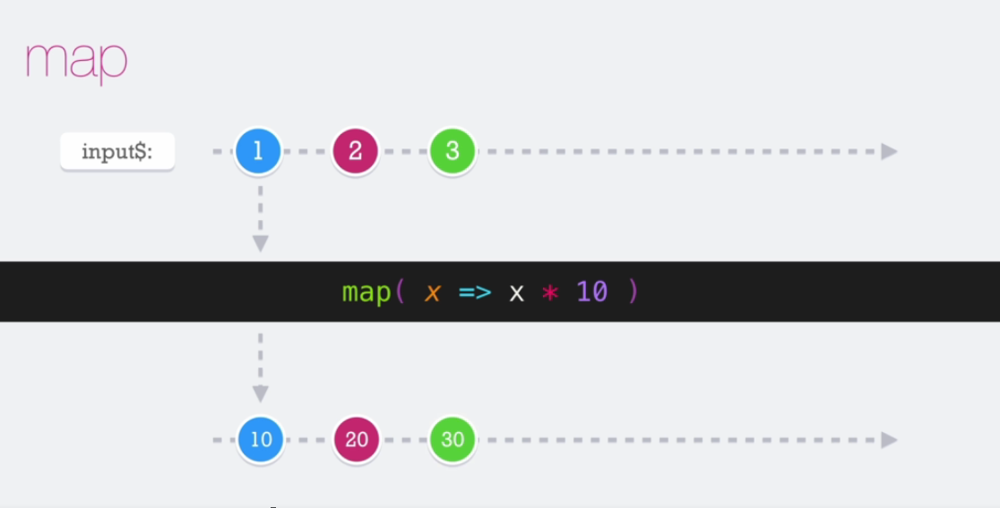

La nomenclatura del operador map() sería `map<E, S>(function(value: T, index: number) => R, thisArg?: any): OperatorFunction<T, R>` donde

* **E:** El tipo de valor de entrada.
* **S:** El tipo de valor de salida.
* **function:** La función que se aplicará a cada valor emitido por el Observable. El cual podra tener un parámetro`index`
* **thisArg:** Un argumento `opcional` para definir el valor del this en la función de proyección. Por defecto es `undefined`.

```ts
import { map } from "rxjs/operators";
import { range } from "rxjs";

const number$ = range(1, 5);

number$.pipe(map<number, number>((number) => number * 2)).subscribe(console.log);
// Salida: 2, 4, 6, 8, 10
```

Es importante que el operador `map()` reciba un return del valor, en el ejemplo anterior al ser función linea el return viene intrinseco, pero al tener al menos 2 lineas se genera una función con `{}` lo que exige que se coloque un return

```ts
range(1, 5).pipe(
    map<number, number>((val, i) => {
        val = i === 0 ? val * 10 : val * 20
        return val;
    })
).subscribe(console.log)
// Salida: 10, 40, 60, 80, 100
```
En caso de no colocarlo y no especificar el tipo de salida que tendrá el operador la salida sera `undefined`

```ts
range(1, 5).pipe(
    map((val, i) => {
        val = i === 0 ? val * 10 : val * 20
    })
).subscribe(console.log)
// Salida: undefined, undefined, undefined, undefined, 1undefined
```
El uso del `map()` es bastante amplio, por ejemplo si recibimos un objeto, podemos especificar que retorne solo el valor que indiquemos

```ts
const keyup$ = fromEvent<KeyboardEvent>( document, 'keyup')

keyup$.pipe(
    map(val => val.key)
).subscribe(console.log)
```


### pluck()

El operador `pluck()` nos permite extrae propiedadas de un objeto. ~~Propiedad actualmente en desuso~~. Se reemplaza por el operador `map()`. Ejemplo al final.

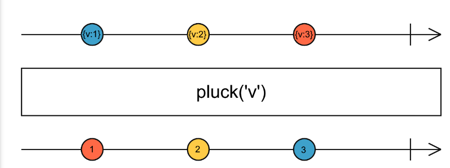

La nomenclatura del operador pluck() sería `pluck<E,S>(...properties: string[]): OperatorFunction<E,S>` donde

* **E:** El tipo de valor de entrada.
* **S:** El tipo de valor de salida.
* **properties:** Las propiedades anidadas que obtener de cada elemento de la fuente (un objeto).

```ts
import { pluck } from "rxjs/operators";
import { from } from "rxjs";

const language$ = from([
  { name: "Ruby", type: "Multiparadigma" },
  { name: "Haskell", type: "Funcional" },
  { name: "Rust", type: "Multiparadigma" },
]);

language$.pipe(pluck("name")).subscribe(console.log);
// Salida: Ruby, Haskell, Rust
```

También podemos sacarlo con obejtos anidados

```ts
import { pluck } from "rxjs/operators";
import { of } from "rxjs";

const githubUser$ = of(
  { name: "zaldih", stats: { repositories: 23 } },
  { name: "NyaGarcia", stats: { repositories: 30 } },
  { name: "caballerog", stats: { repositories: 89 } },
  { name: "tonivj5", stats: { repositories: 51 } }
);

githubUser$.pipe(pluck("stats", "repositories")).subscribe(console.log);
// Salida: 23, 30, 89, 51
```
El operador `pluck()` ss como `map()`, pero se utiliza para extraer una de las propiedades anidadas de los objetos emitidos. Por ejemplo proyectar cada click a la propiedad tagName del elemento target del click

```ts
import { fromEvent } from "rxjs";
import { pluck } from "rxjs/operators";

const clicks = fromEvent(document, "click");
const tagNames = clicks.pipe(pluck("target", "tagName"));
tagNames.subscribe((x) => console.log(x));
```

> Nota **~~Propiedad en Desuso~~**

Actualmente se puede realizar la misma funcionalidad usando map
```ts
const keyupPluck$ = keyup$.pipe(     
      pluck('target', 'baseURI')    
 );

// Equiparable a

const keyupPluck$ = keyup$.pipe(    
    map(x => x.target['baseURI'])
);
```

### mapTo()

El operador `mapTo()` nos permite emitir el mismo valor cada vez que el Observable fuente emite un valor. ~~Propiedad actualmente en desuso~~. Se reemplaza por el operador `map()`. Ejemplo al final.

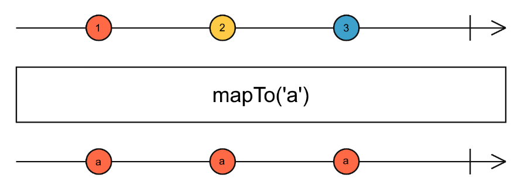

La nomenclatura del operador mapTo() sería `mapTo<E,S>(value: res): OperatorFunction<E,S>` donde

* **E:** El tipo de valor de entrada.
* **S:** El tipo de valor de salida.
* **value:** El valor al que proyectar cada emisión.

```ts
import { mapTo } from "rxjs/operators";
import { interval } from "rxjs";

const number$ = interval(1000);

number$.pipe(mapTo("La respuesta es 42")).subscribe(console.log);
// Salida: La respuesta es 42, La respuesta es 42, La respuesta es 42, La respuesta es 42...
```
Otro ejemplo es usarlo para emitir "¡Tecla pulsada!" cada vez que se pulse una tecla

```ts
import { mapTo } from "rxjs/operators";
import { fromEvent } from "rxjs";

const key$ = fromEvent(document, "keydown");

key$.pipe(mapTo("¡Tecla pulsada!")).subscribe(console.log);
// Salida: (keyPress) ¡Tecla pulsada!...
```

Otro ejemplo sería proyectar cada click a la cadena 'Hi'

```ts
import { fromEvent } from "rxjs";
import { mapTo } from "rxjs/operators";

const clicks = fromEvent(document, "click");
const greetings = clicks.pipe(mapTo("Hi"));
greetings.subscribe((x) => console.log(x));
```

> Nota **~~Propiedad en Desuso~~**

Actualmente se puede realizar la misma funcionalidad usando map
```ts
const keyup$ = fromEvent<KeyboardEvent>( document, 'keyup')

keyup$.pipe(
    mapTo("key")
).subscribe(console.log)

// Equiparable a

keyup$.pipe(
    map(a => "key")
).subscribe(console.log)
```

### filter()
El operador `filter()` filtrar los elementos emitidos por el Observable, emitiendo únicamente aquellos que cumplan una condición. Al igual que un `Array.filter()`, solo emitirá un valor si cumple una condición determinada.

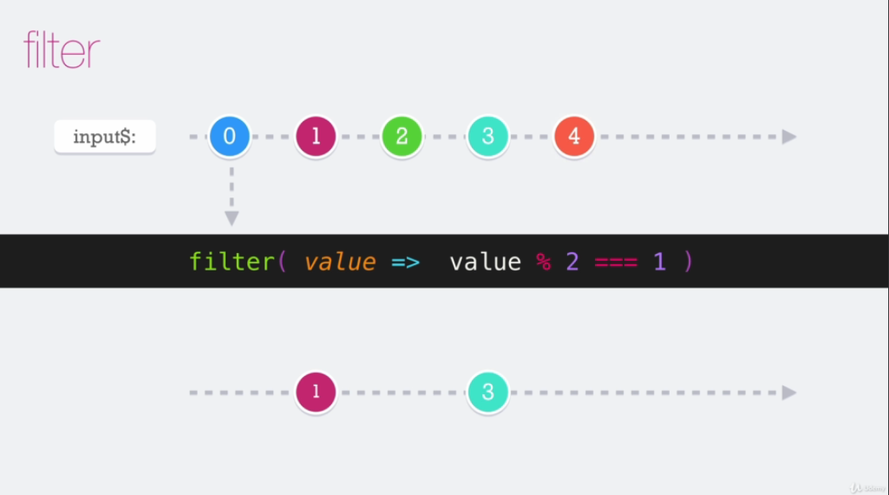

La nomenclatura del operador sería `filter<E>(predicate: (value: E, index: number) => boolean, thisArg?: any): MonoTypeOperatorFunction<T>` donde

* **E:** El tipo de valor de entrada.
* **S:** El tipo de valor de salida.
* **predicate:** Una función que evalúa cada valor emitido por el Observable fuente. Si retorna true, el valor se emite. Si retorna false, el valor no se emite.
* **thisArg:** Un argumento opcional para determinar el valor del this en la función predicate. por defecto es `undefined`
* **MonoTypeOperatorFunction<T>:** El retorno de un Observable que han cumpliado la condición especificada por la función `predicate`.

```ts
import { filter } from "rxjs/operators";
import { range } from "rxjs";

const number$ = range(1, 10);

number$.pipe(filter((n) => n > 5)).subscribe(console.log);
// Salida: 6, 7, 8, 9, 10
```
Otro ejemplo pudiese ser emitir todas las teclas, excepto la barra espaciadora

```ts
import { filter, map } from "rxjs/operators";
import { fromEvent } from "rxjs";

const key$ = fromEvent<KeyboardEvent>(document, "keydown");

key$
  .pipe(
    map(({ code }) => code),
    filter((code) => code !== "Space")
  )
  .subscribe(console.log);
// Salida: KeyX, KeyO...
```


### tap()
El operador `tap()` Lleva a cabo un efecto colateral en cada emisión del Observable fuente, pero retorna un Observable que es idéntico a la fuente.
Este operador es muy útil para depurar Observables (ver si el valor emitido es correcto) o para llevar a cabo cualquier tipo de efecto colateral.

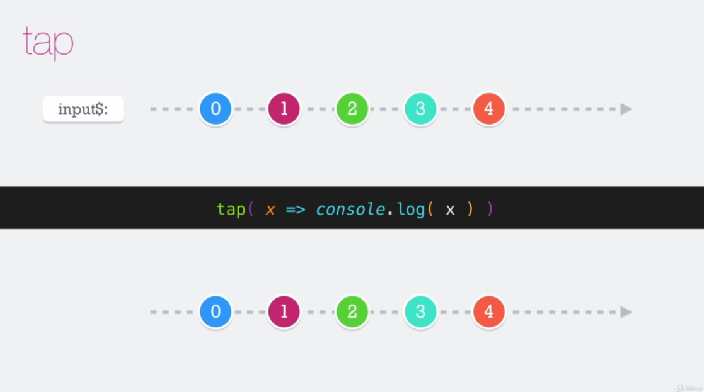

>Nota: este operador es diferente al subscribe del Observable. Si no se realiza una suscripción al Observable retornado por tap, los efectos colaterales que se hayan especificado no ocurrirán nunca. Por tanto, tap se limita a espiar a la ejecución existente, en lugar de disparar una ejecución como hace subscribe.

La nomenclatura del operador sería `tap<T>(nextOrObserver?: NextObserver<T> | ErrorObserver<T> | CompletionObserver<T> | ((x: T) => void), error?: (e: any) => void, complete?: () => void): MonoTypeOperatorFunction<T>` donde

* **nextOrObserver:** Un objeto Observador normal o una función *callback* para next. El valor por defecto es undefined.
* **error:** El valor por defecto es undefined. Función *callback* para los errores de la fuente.
* **complete:**  El valor por defecto es undefined. Callback for the completion of the source.
* **thisArg:** Un argumento opcional para determinar el valor del this en la función predicate. por defecto es `undefined`
* **MonoTypeOperatorFunction<T>:** Un Observable idéntico a la fuente, pero ejecuta el Observador o la/las callbacks en cada emisión..

Su firma sería `tap(next: null, error: null, complete: () => void): MonoTypeOperatorFunction<T>`

Un buen ejemplo de este operador sería hacer un console.log para ver el antes y el después de una operación map

```ts
import { of } from "rxjs";
import { map, tap } from "rxjs/operators";

const fruit$ = of("Cereza", "Fresa", "Arándano");

fruit$
  .pipe(
    tap((fruit) => console.log(`Antes: ${fruit}`)),
    map((fruit) => fruit.toUpperCase()),
    tap((fruit) => console.log(`Después: ${fruit}`))
  )
  .subscribe();

/* Salida:
Antes: Cereza, Después: CEREZA,
Antes: Fresa, Después: FRESA,
Antes: Arándano, Después: ARÁNDANO
*/
```

Otro ejemplo pudiese ser actualizar una variable externa con la respuesta de una petición

```ts
import { tap, map, concatMap } from "rxjs/operators";
import { of } from "rxjs";
import { ajax } from "rxjs/ajax";

const pokemonId$ = of(3, 5, 6);
let pokedex = [];

function getPokemonName(id: number) {
  return ajax.getJSON(`https://pokeapi.co/api/v2/pokemon/${id}`).pipe(
    tap((pokemonData) => (pokedex = [...pokedex, pokemonData])),
    map(({ name }) => name)
  );
}

pokemonId$.pipe(concatMap((id) => getPokemonName(id))).subscribe(console.log, console.error, () => {
    console.log(pokedex));
// Output: venusaur, charmeleon, charizard, [{}, {}, {}]
```

También se pudiese proyectar cada click a su posición clientX, después de hacer un console.log del evento click completo

```ts
import { fromEvent } from "rxjs";
import { tap, map } from "rxjs/operators";

const clicks = fromEvent(document, "click");
const positions = clicks.pipe(
  tap((ev) => console.log(ev)),
  map((ev) => ev.clientX)
);
positions.subscribe((x) => console.log(x));
```

### reduce()
El operador `reduce()` Aplica una función acumuladora al Observable fuente y retorna el resultado acumulado una vez se completa la fuente

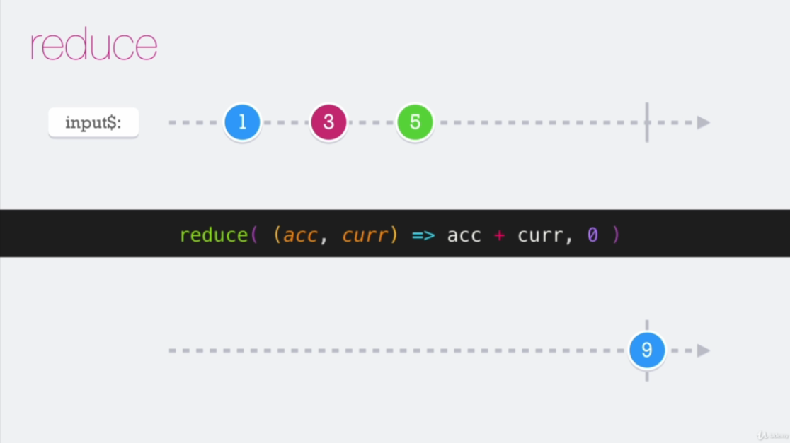

La nomenclatura del operador sería `reduce<T, R>(accumulator: (acc: T | R, value: T, index?: number) => T | R, seed?: T | R): OperatorFunction<T, T | R>` donde

* **accumulator:** La función acumuladora que se llama por cada valor de la fuente.
* **seed:** . El valor de acumulación inicial. El valor por defecto es undefined
* **OperatorFunction<T, T | R>:** Un Observable que emite un solo valor, resutante de haber acumulado los valores emitidos por el Observable fuente.

Su firma sería `reduce(accumulator: (acc: R, value: T, index: number) => R, seed: R): OperatorFunction<T, R>`

Un buen ejemplo sería contar el número de eventos click que ocurran en 5 segundos

```ts
import { fromEvent, interval } from "rxjs";
import { reduce, takeUntil, mapTo } from "rxjs/operators";

const clicksInFiveSeconds = fromEvent(document, "click").pipe(
  takeUntil(interval(5000))
);
const ones = clicksInFiveSeconds.pipe(mapTo(1));
const seed = 0;
const count = ones.pipe(reduce((acc, one) => acc + one, seed));
count.subscribe((x) => console.log(x));
```

El `reduce()` en RXJS es equiparable al de JS

```ts
const totalReducer = (acumulador: number, valorActual: number) => {
    return acumulador + valorActual;
}

const total = numbers.reduce(totalReducer, 0)

console.log(total);

// Es Equiparable a

interval(500).pipe(
    take(6),
    tap(console.log),
    reduce(totalReducer)
).subscribe({
    next: val => console.log('next', val),
    complete: () => console.log('Complete')
})
```

### scan()

El operador `scan()` Aplica una función acumuladora a los valores del Observable fuente y retorna cada resultado inmediato

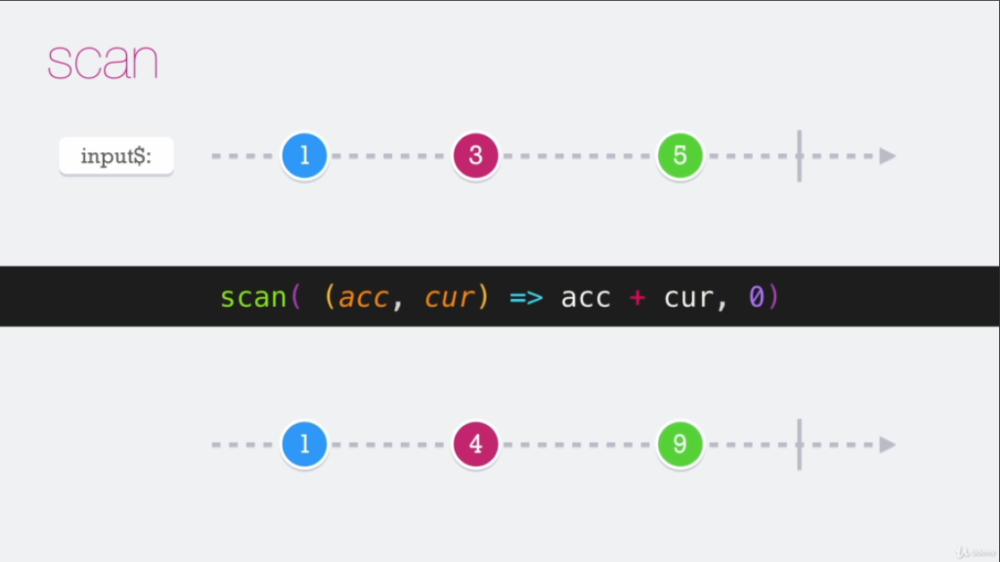

Combina todos los valores emitidos por la fuente, mediante una función de acumulación. Es similar al operador reduce, pero emite cada valor acumulado.

Retorna un Observable que aplica una función de acumulación a cada elemento emitido por el Observable fuente. Si se proporciona un valor seed, ese valor se utilizará como el valor inicial del acumulador. Si no se proporciona ningún valor inicial, se utilizará el primer elemento emitido por la fuente en su lugar.

La nomenclatura del operador sería `scan<T, R>(accumulator: (acc: R, value: T, index: number) => R, seed?: T | R): OperatorFunction<T, R>` donde

* **accumulator:** La función de acumulación que se aplica a cada valor emitido.
* **seed:**  El valor de acumulación inicial. El valor por defecto es undefined.


Su firma sería `scan(accumulator: (acc: R, value: T, index: number) => R, seed: R): OperatorFunction<T, R>`

Un buen ejemplo es sumar una secuencia de números

```ts
import { scan } from "rxjs/operators";
import { range } from "rxjs";

const number$ = range(1, 10);

number$.pipe(scan((acc, val) => acc + val)).subscribe(console.log);
// Salida: 1, 3, 6, 10, 15, 21, 28, 36, 45, 55
```

Otro ejemplo pudiese ser sumar una secuencia de números proporcionando un valor inicial

```ts
import { scan } from "rxjs/operators";
import { range } from "rxjs";

const number$ = range(1, 10);

number$.pipe(scan((acc, val) => acc + val, 10)).subscribe(console.log);
// Salida: 11, 13, 16, 20, 25, 31, 38, 46, 55, 65
```

También se pudiese concatenar una secuencia de cadenas

```ts
import { scan } from "rxjs/operators";
import { from } from "rxjs";

const letter$ = from(["R", "x", "J", "S", " ", "m", "o", "l", "a"]);

letter$.pipe(scan((acc, val) => acc + val)).subscribe(console.log);
/*Salida: R
          Rx
          RxJ
          RxJS
          RxJS 
          RxJS m
          RxJS mo
          RxJS mol 
          RxJS mola
*/
```
O contar el número de eventos click

```ts
import { fromEvent } from "rxjs";
import { scan, mapTo } from "rxjs/operators";

const clicks = fromEvent(document, "click");
const ones = clicks.pipe(mapTo(1));
const seed = 0;
const count = ones.pipe(scan((acc, one) => acc + one, seed));
count.subscribe((x) => console.log(x));
```

### first()
El operador `first()` Emite el primer valor (o el primer valor que cumpla una condición) emitido por el Observable fuente

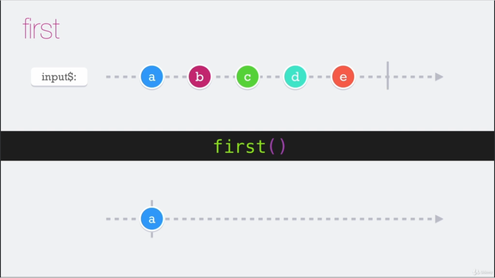

`first()` Emite únicamente el primer valor. O emite el primer valor que cumpla alguna condición. Si se llama sin ningún argumento, `first()` emite el primer valor del Observable fuente y se completa. Si se llama con una función `predicate`, first emite el valor de la fuente que cumpla la condición especificada. También puede recibir un valor por defecto, que se emite en el caso de que la fuente se complete sin emitir ningún elemento válido. Lanza un error en el caso de que no se encuentre un elemento válido y no se haya proporcionado un defaultValue .

La nomenclatura del operador sería `first<T, D>(predicate?: (value: T, index: number, source: Observable<T>) => boolean, defaultValue?: D): OperatorFunction<T, T | D>` donde

* **predicate:** Una función opcional que aplicar a cada elemento para comprobar si cumple o no una condición.
* **defaultValue<T>:**  El valor por defecto que se emitirá en el caso de que no se encuentre ningún elemento válido.
* **OperatorFunction<T, T | D>:**  Un Observable del primer elemento que cumpla la condición especificada.


Su firma sería `scan(accumulator: (acc: R, value: T, index: number) => R, seed: R): OperatorFunction<T, R>`

Un buen ejemplo sería emitir la primera cadena de una secuencia

```ts
import { first } from "rxjs/operators";
import { from, fromEvent } from "rxjs";

const fruit$ = from(["Cereza", "Fresa", "Arándano"]);

fruit$.pipe(first()).subscribe(console.log);
// Salida: Cereza
```

Otro ejemplo pudiese ser emitir la primera tecla pulsada

```ts
import { first, map } from "rxjs/operators";
import { fromEvent } from "rxjs";

const keyPressed$ = fromEvent<KeyboardEvent>(document, "keydown");

keyPressed$
  .pipe(
    first(),
    map(({ code }) => code)
  )
  .subscribe(console.log);
// Salida: KeyX
```

También se pudiese emitir el primer elemento que cumpla una condición

```ts
import { of } from "rxjs";
import { first } from "rxjs/operators";

const user$ = of(
  { name: "NyaGarcía", age: 23 },
  { name: "zaldih", age: 21 },
  { name: "caballerog", age: 35 }
);

user$.pipe(first(({ age }) => age === 21)).subscribe(console.log);
// Salida: { name: 'zaldih', age: 21 }
```
También se pudiese eroporcionar un valor por defecto, que será emitido si ningún elemento cumple la condición

```ts
import { first } from "rxjs/operators";
import { from } from "rxjs";

const language$ = from([
  { name: "Ruby", type: "Multiparadigma" },
  { name: "Haskell", type: "Funcional" },
  { name: "Rust", type: "Multiparadigma" },
]);

language$
  .pipe(
    first(({ type }) => type === "Orientado a objetos", {
      name: "Java",
      type: "Orientado a objetos",
    })
  )
  .subscribe(console.log);
// Salida: { name: "Java", type: "Orientado a objetos" }
```

Emitir solo el primer click que ocurra en el DOM

```ts
import { fromEvent } from "rxjs";
import { first } from "rxjs/operators";

const clicks = fromEvent(document, "click");
const result = clicks.pipe(first());
result.subscribe((x) => console.log(x));
```

Emitir el primer click que ocurra en un DIV
```ts
import { fromEvent } from "rxjs";
import { first } from "rxjs/operators";

const clicks = fromEvent(document, "click");
const result = clicks.pipe(first((ev) => ev.target.tagName === "DIV"));
result.subscribe((x) => console.log(x));
```

### take()
El operador `take()` Emite las primeras x emisiones del Observable fuente

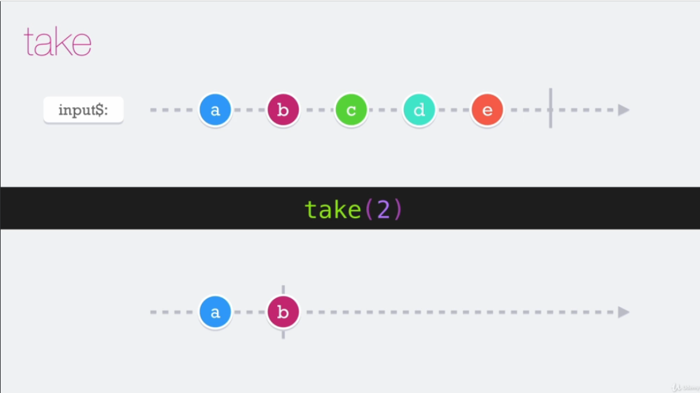

`take()` retorna un Observable que emite únicamente los primeros count valores emitidos por el Observable fuente. Si la fuente emite menos de n valores, entonces se emiten todos los valores. Después, se completa el Observable, independientemente de si la fuente se completa o no.

La nomenclatura del operador sería `take<T>(count: number): MonoTypeOperatorFunction<T>` donde

* **count:** El máximo número de valores que se emitirán.
* **MonoTypeOperatorFunction<T>:**  Un Observable que emite o las primeras `count` emisiones del Observable fuente, o todas las emisiones si el Observable fuente emite menos de count valores.


Su firma sería `scan(accumulator: (acc: R, value: T, index: number) => R, seed: R): OperatorFunction<T, R>`

Un buen ejemplo sería emitir las primeras 5 teclas pulsadas

```ts
import { map, take } from "rxjs/operators";
import { fromEvent } from "rxjs";

const key$ = fromEvent<KeyboardEvent>(document, "keydown");

key$
  .pipe(
    map(({ code }) => code),
    take(5)
  )
  .subscribe(console.log);
// Salida: KeyR, KeyX, KeyJ, KeyS, Space
```

Otro ejemplo pudiese ser emitir los primeros 3 títulos de películas de Studio Ghibli

```ts
import { ajax } from "rxjs/ajax";
import { map, mergeAll, take } from "rxjs/operators";

const ghibliFilm$ = ajax.getJSON("https://ghibliapi.herokuapp.com/films").pipe(
  mergeAll(),
  map(({ title }) => title)
);

ghibliFilm$.pipe(take(5)).subscribe(console.log);
// Salida: Castle in the Sky, Grave of the Fireflies, My Neighbor Totoro
```

También se pudiese concatenar una secuencia de cadenas

```ts
import { scan } from "rxjs/operators";
import { from } from "rxjs";

const letter$ = from(["R", "x", "J", "S", " ", "m", "o", "l", "a"]);

letter$.pipe(scan((acc, val) => acc + val)).subscribe(console.log);
/*Salida: R
          Rx
          RxJ
          RxJS
          RxJS 
          RxJS m
          RxJS mo
          RxJS mol 
          RxJS mola
*/
```
También se pudiesebtener los 5 primeros segundos de un Observable infinito de un intervalo de 1 segundo.

```ts
import { interval } from "rxjs";
import { take } from "rxjs/operators";

const intervalCount = interval(1000);
const takeFive = intervalCount.pipe(take(5));
takeFive.subscribe((x) => console.log(x));

// Salida: 0, 1, 2, 3, 4
```

### takeWhile()

El operador `takeWhile()` Emite las emisiones del Observable fuente siempre y hasta cuando cumplan la condición especificada. 

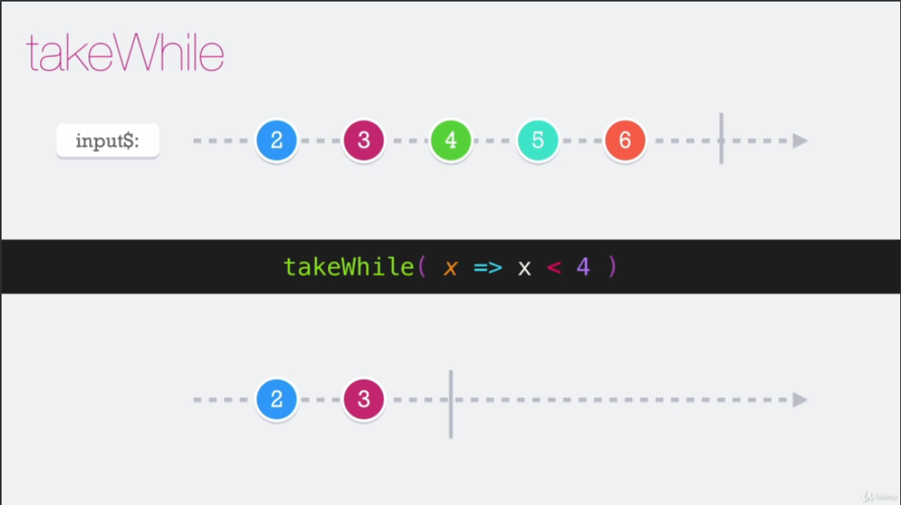

`takeWhile()` Emite los valores del Observable fuente mientras cumplan la condición especificada. En cuanto un valor no la cumpla, se completa. Se completa en cuanto haya un valor que no cumpla la condición. `takeWhile()` se suscribe al Observable fuente y comienza a reflejarlo. Cada valor que se emita en la fuente, se proporciona a la función `predicate`, que retorna un valor booleano. Este valor indica si el valor cumple o no la condición especificada. El Observable resultante emite los valores del Observable fuente hasta que la condición deje de cumplirse. En ese momento, `takeWhile` deja de emitir los valores del Observable fuente y hace que el Observable resultante se complete.

La nomenclatura del operador sería `takeWhile<T>(predicate: (value: T, index: number) => boolean, inclusive: boolean = false): MonoTypeOperatorFunction<T>` donde

* **predicate:** Una función que evalúa cada valor emitido por el Observable fuente y retorna un booleano. Recibe un índice (de base cero) como segundo argumento.
* **inclusive:** Cuando valga true, el primer valor que incumpla la condición también se emitirá. El valor por defecto es `false`.
* **MonoTypeOperatorFunction<T>:**  Un Observable que emite los valores del Observable fuente siempre y cuando cada valor cumpla la condición especificada.


Su firma sería `takeWhile(predicate: (value: T, index: number) => boolean, inclusive?: boolean): MonoTypeOperatorFunction<T>`

Un buen ejemplo sería Emitir números mientras sean menores que 10

```ts
import { takeWhile } from "rxjs/operators";
import { interval } from "rxjs";

const number$ = interval(1000);

number$
  .pipe(takeWhile((number) => number < 10))
  .subscribe(console.log, console.error, () => console.log("Completado"));
// Salida: 0, 1, 2, 3, 4, 5, 6, 7, 8, 9, Completado
```

Otro ejemplo pudiese ser Emitir las teclas pulsadas mientras no se pulse la tecla x

```ts
import { map, takeWhile } from "rxjs/operators";
import { fromEvent } from "rxjs";

const key$ = fromEvent<KeyboardEvent>(document, "keydown");

key$
  .pipe(
    takeWhile(({ code }) => code !== "KeyX"),
    map(({ code }) => code)
  )
  .subscribe(console.log, console.error, () => console.log("Completado"));
// Salida: KeyP, KeyC, KeyM (Pulsar KeyX), Completado
```

También se pudiese emitir lenguajes mientras sean de tipo Multiparadigma

```ts
import { from } from "rxjs";
import { takeWhile } from "rxjs/operators";

const language$ = from([
  { name: "Ruby", type: "Multiparadigma" },
  { name: "Rust", type: "Multiparadigma" },
  { name: "Java", type: "Orientado a objetos" },
  { name: "Scala", type: "Multiparadigma" },
  { name: "Haskell", type: "Funcional" },
]);

language$
  .pipe(takeWhile(({ type }) => type === "Multiparadigma"))
  .subscribe(console.log);
// Salida: { name: "Ruby", type: "Multiparadigma" }, { name: "Rust", type: "Multiparadigma" }
```
Si se proporciona el valor true como segundo argumento (parámetro inclusive), el primer elemento que no cumpla la condición también se emite

```ts
import { interval } from "rxjs";
import { from } from "rxjs";
import { takeWhile } from "rxjs/operators";

const programmingLanguage$ = from([
  { name: "Simula", type: "Object-oriented" },
  { name: "Java", type: "Object-oriented" },
  { name: "Wolfram", type: "Declarative" },
  { name: "Ruby", type: "Multiparadigm" },
]);

// Si se proporciona el valor true como segundo argumento (parámetro inclusive), el primer elemento que no cumpla la condición también se emite
programmingLanguage$
  .pipe(takeWhile(({ type }) => type === "Object-oriented", true))
  .subscribe(console.log);
// Salida: { name: "Simula", type: "Object-oriented" }, { name: "Java", type: "Object-oriented" }, { name: "Wolfram", type: "Declarative" }
```

Emite los eventos click mientras su propiedad clientX sea mayor a 200

```ts
import { fromEvent } from "rxjs";
import { takeWhile } from "rxjs/operators";

const clicks = fromEvent(document, "click");
const result = clicks.pipe(takeWhile((ev) => ev.clientX > 200));
result.subscribe((x) => console.log(x));
```


### takeUntil()

El operador `takeUntil()` Emite los valores emitidos por el Observable fuente hasta que un segundo Observable emita un valor

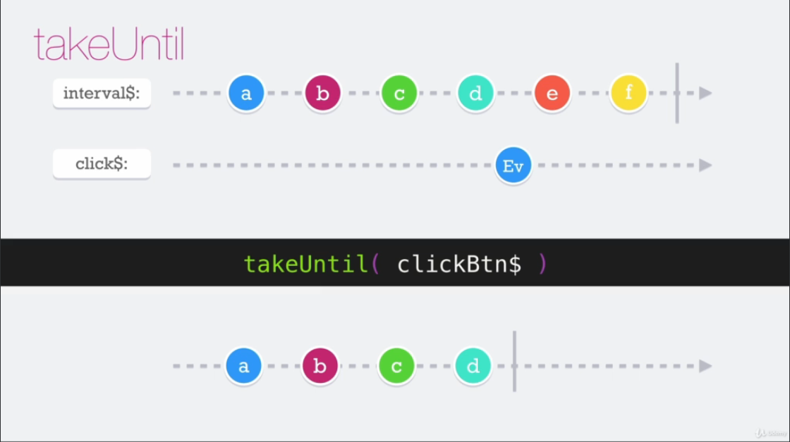

`takeUntil()` Emite valores hasta que un segundo Observable, el notificador, emita un valor. Entonces, se completa. takeUntil se suscribe y comienza a reflejar el Observable fuente. También se encarga de monitorizar un segundo Observable, el notificador que se haya proporcionado. Si el notificador emite un valor, el Observable resultante deja de emitir los valores del Observable fuente y se completa.

Si el notificador no emite ningún valor y se completa, takeUntil emitirá todos los valores.

La nomenclatura del operador sería `takeUntil<T>(notifier: Observable<any>): MonoTypeOperatorFunction<T>` donde

* **notifier:** El Observable cuya primera emisión hará que el Observable resultante deje de emitir los valores del Observable fuente.


Su firma sería `takeUntil<T>(notifier: Observable<any>): MonoTypeOperatorFunction<T>`

Un buen ejemplo sería Emitir valores hasta que timer$ emita a los 4 segundos

```ts
import { takeUntil } from "rxjs/operators";
import { interval, timer } from "rxjs";

const number$ = interval(1000);
const timer$ = timer(4000);

number$.pipe(takeUntil(timer$)).subscribe(console.log);
// Salida: 0, 1, 2
```

Otro ejemplo pudiese ser Emitir valores hasta que se pulse una tecla

```ts
import { takeUntil } from "rxjs/operators";
import { interval, fromEvent } from "rxjs";

const number$ = interval(1000);
const key$ = fromEvent(document, "keydown");

number$.pipe(takeUntil(key$)).subscribe(console.log);
// Salida: O, 1, 2, 3, 4 (Pulsar tecla)
```

También se pudiese Cancelar la ejecución de un Observable con un Sujeto y takeUntil.

Una técnica muy útil para poder cancelar la ejecución de uno o varios Observables es utilizar un Sujeto junto al operador `takeUntil`. De esta manera, no hay que cancelar la suscripción manualmente a todos los Observables que se crean. A continuación, una demostración de esta técnica:

Para cancelar la suscripción a un Observable, se debe almacenar la suscripción a dicho Observable, y llamar al método `unsubscribe`. Esto implica que por cada Observable que se cree, se debe almacenar una Suscripción. Esta forma de cancelar suscripciones es tediosa e imposible de mantener a medida que una aplicación escala.

```ts
import { interval, timer } from "rxjs";
import { tap } from "rxjs/operators";

const number$ = interval(1000);

const number$Subscription = number$.subscribe(console.log);

number$Subscription.unsubscribe();
```

Sin embargo, al utilizar el operador takeUntil, ya no es necesario almacenar ninguna suscripción. Lo único que hay que hacer es crear un Sujeto, y utilizar takeUntil con dicho Sujeto, de tal forma que cuando stop$ emita un valor, todo Observable que utilice el operador se cancelará.

```ts
import { takeUntil, tap } from "rxjs/operators";
import { interval, timer, Subject } from "rxjs";

const stop$ = new Subject<void>();

function stop() {
  stop$.next();
  stop$.complete();
}

// Al cabo de 5s, se llamará a la función stop
timer(5000).pipe(tap(_ => stop())).subscribe();

// Will emit numbers until we call the stop function
interval(1000)
  .pipe(takeUntil(stop$))
  .subscribe(console.log);
// Salida: 0, 1, 2, 3, 4 (llamada a stop())
```

Emitir una secuencia de números cada segundo, hasta que se haga click

```ts
import { fromEvent, interval } from "rxjs";
import { takeUntil } from "rxjs/operators";

const source = interval(1000);
const clicks = fromEvent(document, "click");
const result = source.pipe(takeUntil(clicks));
result.subscribe((x) => console.log(x));
```


### skip()
El operador `skip()` Retorna un Observable que se salta las primeras x emisiones del Observable fuente

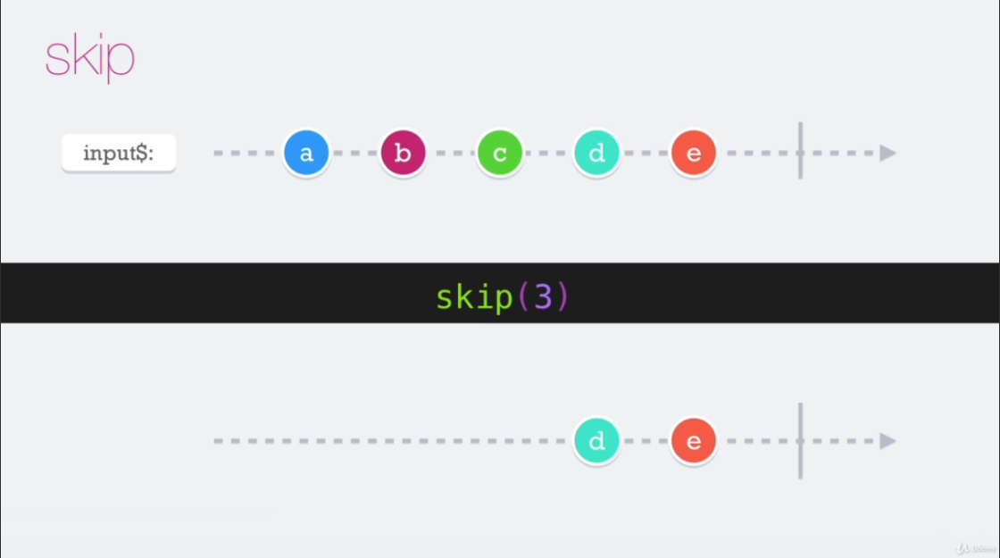

`skip` se salta un número determinado por el parámetro count de emisiones del Observable fuente, y después continúa emitiendo valores normalmente.

La nomenclatura del operador sería `skip<T>(count: number): MonoTypeOperatorFunction<T>` donde

* **count:** El número de elementos del Observable fuente que serán saltados.

* **MonoTypeOperatorFunction<T>:** Un Observable que se salta valores emitidos por el Observable fuente.


Su firma sería `takeUntil<T>(notifier: Observable<any>): MonoTypeOperatorFunction<T>`

Un buen ejemplo sería Ignorar los primeros 5 clicks

```ts
import { skip } from "rxjs/operators";
import { from, fromEvent } from "rxjs";

const click$ = fromEvent(document, "click");

click$.pipe(skip(5)).subscribe(console.log);
// Salida: ......... ClickEvent {}...
```

Otro ejemplo pudiese ser Ignorar el primer elemento

```ts
import { skip } from "rxjs/operators";
import { from } from "rxjs";

const language$ = from([
  { name: "Java", type: "Orientado a objetos" },
  { name: "Ruby", type: "Multiparadigma" },
  { name: "Haskell", type: "Funcional" },
]);

language$.pipe(skip(1)).subscribe(console.log);
// Salida: { name: "Ruby", type: "Multiparadigma" }, { name: "Haskell", type: "Funcional" }
```

### distinct()
El operador `distinct()` Retorna un Observable que emite todos los elementos del Observable fuente que sean distintos a los elementos anteriores

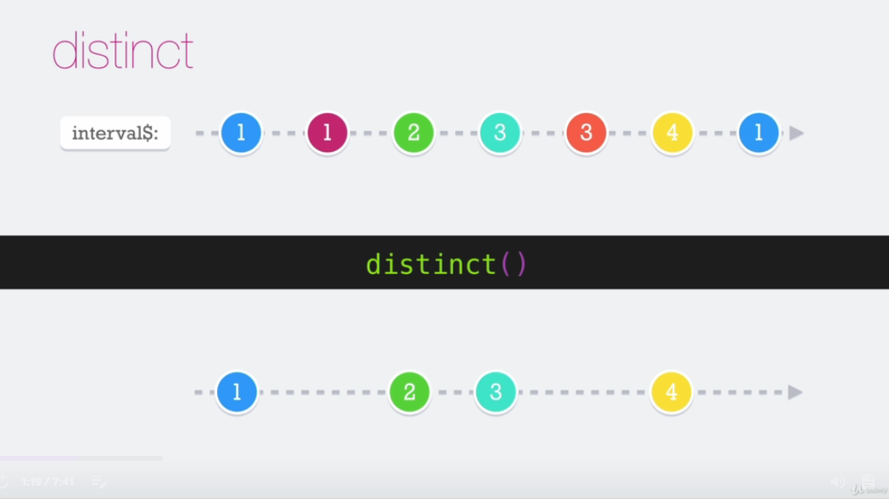

Si se proporciona una función keySelector, se proyectará cada valor emitido por el Observable fuente a un nuevo valor, que se comparará con los valores previamente emitidos para ver si es distinto o no. Si no se proporciona una función keySelector, se compararán los valores emitidos por el Observable fuente directamente con las emisiones previas.

En los entornos de ejecución de JavaScript que den soporte a Set, distinct utilizará un Set para mejorar el rendimiento de la comprobación de distinción.

En otros entornos de ejecución, distinct utilizará una implementación mínima de Set que depende de un Array y de indexOf, por lo que el rendimiento empeorará de forma directamente proporcional a la cantidad de valores que se proporcionen. Incluso en los navegadores más modernos, un distinct ejecutándose durante un periodo largo de tiempo puede provocar fugas de memoria. Para minimizar este efecto en algunos escenarios, se puede proporcionar un parámetro `flushes` opcional para reiniciar el `Set` interno, eliminando todos sus valores.

La nomenclatura del operador sería `distinct<T, K>(keySelector?: (value: T) => K, flushes?: Observable<any>): MonoTypeOperatorFunction<T>` donde

* **keySelector:** El número de elementos del Observable fuente que serán saltados.

* **flushes:** Observable opcional para reiniciar el HashSet interno del operador. El valor por defecto es `undefined`.

* **MonoTypeOperatorFunction<T>:** Un Observable que se salta valores emitidos por el Observable fuente.


Su firma sería `takeUntil<T>(notifier: Observable<any>): MonoTypeOperatorFunction<T>`

Un buen ejemplo sería Usar distinct sin un selector

```ts
import { distinct } from "rxjs/operators";
import { of } from "rxjs";

const fruit$ = of(
  "Fresa",
  "Cereza",
  "Cereza",
  "Arándano",
  "Fresa",
  "Arándano",
  "Cereza"
);

fruit$.pipe(distinct()).subscribe(console.log);
// Salida: Fresa, Cereza, Arándano
```

Otro ejemplo pudiese ser Usar distinct con un selector de clave

```ts
import { distinct } from "rxjs/operators";
import { of } from "rxjs";

const language$ = of(
  { name: "Java", type: "Orientado a objetos" },
  { name: "Ruby", type: "Multiparadigma" },
  { name: "Ruby", type: "Multiparadigma" },
  { name: "Haskell", type: "Funcional" },
  { name: "Haskell", type: "Funcional" },
  { name: "Java", type: "Orientado a objetos" },
  { name: "Ruby", type: "Multiparadigma" }
);

language$.pipe(distinct(({ name }) => name)).subscribe(console.log);
/* Salida: 
{ name: "Java", type: "Orientado a objetos" }, 
{ name: "Ruby", type: "Multiparadigma" }, 
{ name: "Haskell", type: "Funcional" }
*/
```

Un ejemplo simple con números

```ts
import { of } from "rxjs";
import { distinct } from "rxjs/operators";

of(1, 1, 2, 2, 2, 1, 2, 3, 4, 3, 2, 1)
  .pipe(distinct())
  .subscribe((x) => console.log(x)); // 1, 2, 3, 4
```

Un ejemplo utilizando la función keySelector

```ts
import { of } from "rxjs";
import { distinct } from "rxjs/operators";

interface Person {
  age: number;
  name: string;
}

of<Person>(
  { age: 4, name: "Foo" },
  { age: 7, name: "Bar" },
  { age: 5, name: "Foo" }
)
  .pipe(distinct((p: Person) => p.name))
  .subscribe((x) => console.log(x));

// Salida:
// { age: 4, name: 'Foo' }
// { age: 7, name: 'Bar' }
```


### distinctUntilChanged()
El operador `distinctUntilChanged()` Retorna un Observable que emite todos los elementos emitidos por el Observable fuente que sean distintos al valor anterior

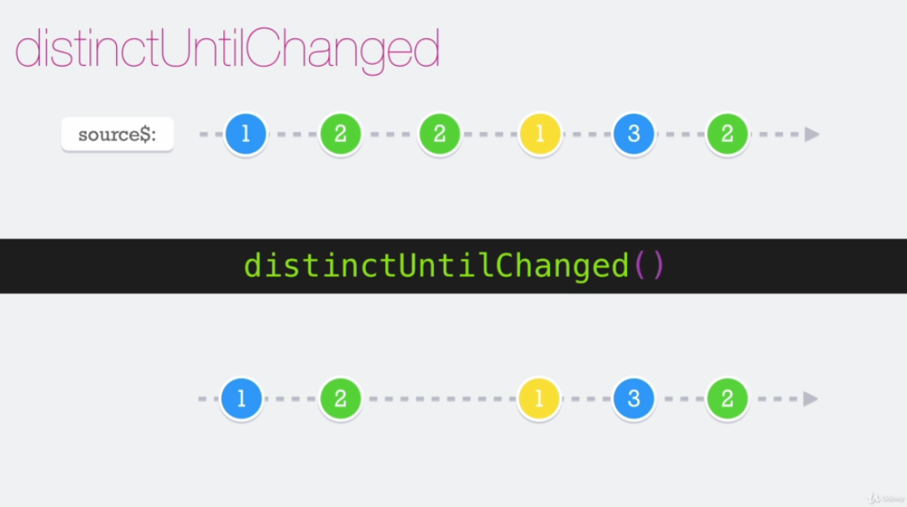

Si se proporciona una función de comparación, se utilizará para comprobar si cada elemento se debe emitir o no.

Si no se proporciona una función de comparación, se utiliza una verificación de igualdad.

La nomenclatura del operador sería `distinctUntilChanged<T, K>(compare?: (x: K, y: K) => boolean, keySelector?: (x: T) => K): MonoTypeOperatorFunction<T>` donde

* **compare:** Función de comparación opcional para comprobar si un elemento es distinto al elemento anterior. El valor por defecto es undefined.

* **keySelector:** Opcional. El valor por defecto es undefined. Tipo: (x: T) => K.

* **MonoTypeOperatorFunction<T>:** Un Observable que emite elementos del Observable fuente que tengan valores distintos.

Un buen ejemplo sería Usar distinctUntilChanged sin una función de comparación

```ts
import { distinctUntilChanged } from "rxjs/operators";
import { of } from "rxjs";

const fruit$ = of("Fresa", "Cereza", "Cereza", "Arándano", "Arándano", "Fresa");

fruit$.pipe(distinctUntilChanged()).subscribe(console.log);
// Salida: Fresa, Cereza, Arándano, Fresa
```

Usar distinctUntilChanged con una función de comparación

```ts
import { distinctUntilChanged } from "rxjs/operators";
import { of } from "rxjs";

const language$ = of(
  { name: "Java", type: "Orientado a objetos" },
  { name: "Ruby", type: "Multiparadigma" },
  { name: "Ruby", type: "Multiparadigma" },
  { name: "Haskell", type: "Funcional" },
  { name: "Haskell", type: "Funcional" },
  { name: "Java", type: "Orientado a objetos" },
  { name: "Ruby", type: "Multiparadigma" }
);

language$
  .pipe(
    distinctUntilChanged(
      ({ name: previousName }, { name }) => previousName === name
    )
  )
  .subscribe(console.log);
/* Salida: 
  { name: "Java", type: "Orientado a objetos" },
  { name: "Ruby", type: "Multiparadigma" },
  { name: "Haskell", type: "Funcional" },
  { name: "Java", type: "Orientado a objetos" },
  { name: "Ruby", type: "Multiparadigma" }
*/
```

Un ejemplo simple con números

```ts
import { of } from "rxjs";
import { distinctUntilChanged } from "rxjs/operators";

of(1, 1, 2, 2, 2, 1, 1, 2, 3, 3, 4)
  .pipe(distinctUntilChanged())
  .subscribe((x) => console.log(x)); // 1, 2, 1, 2, 3, 4
```

Un ejemplo usando una función de comparación

```ts
import { of } from 'rxjs';
import { distinctUntilChanged } from 'rxjs/operators';

interface Person {
    age: number,
    name: string
}

of<Person>(
    { age: 4, name: 'Foo'},
    { age: 7, name: 'Bar'},
    { age: 5, name: 'Foo'},
    { age: 6, name: 'Foo'},
  ).pipe(
    distinctUntilChanged((p: Person, q: Person) => p.name === q.name),
  )
  .subscribe(x => console.log(x));

// displays:
// { age: 4, name: 'Foo' }
// { age: 7, name: 'Bar' }
// { age: 5, name: 'Foo' }
```

### distinctUntilKeyChanged()
El operador `distinctUntilKeyChanged()` Retorna un Observable que emite los elementos del Observable fuente cuya propiedad especificada sea distinta a la del elemento anterior

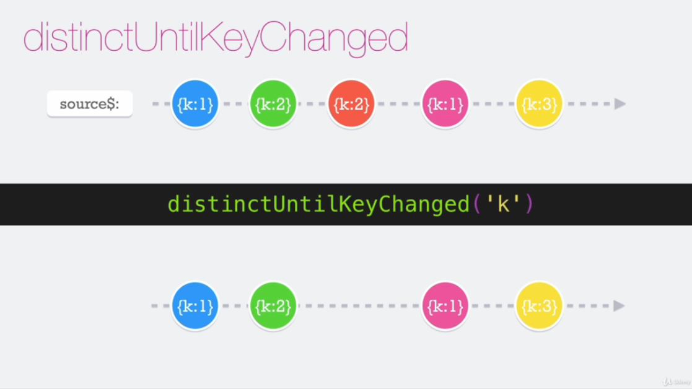

Si se proporciona una función de comparación, se utilizará para comprobar si cada elemento se debe emitir o no.

Si no se proporciona una función de comparación, se utiliza una verificación de igualdad.

La nomenclatura del operador sería `distinctUntilKeyChanged<T, K extends keyof T>(key: K, compare?: (x: T[K], y: T[K]) => boolean): MonoTypeOperatorFunction<T>` donde

* **key:** Clave de la propiedad del objeto que se desea comparar.

* **keySelector:** El valor por defecto es undefined. Función de comparación opcional que se utiliza para comprobar si un elemento es distinto al elemento anterior.

* **MonoTypeOperatorFunction<T>:** Un Observable que emite elementos del Observable fuente si la propiedad especificada es distinta a la del elemento anterior.

Su firma sería `takeUntil<T>(notifier: Observable<any>): MonoTypeOperatorFunction<T>`

Un buen ejemplo sería Emitir solo cuando la tecla pulsada sea distinta a la tecla pulsada anterior

```ts
import { distinctUntilKeyChanged, map } from "rxjs/operators";
import { fromEvent } from "rxjs";

const key$ = fromEvent<KeyboardEvent>(document, "keydown").pipe(
  distinctUntilKeyChanged("code"),
  map(({ code }) => code)
);

key$.subscribe(console.log);
// Salida: (Pulsar tecla y) (Pulsar tecla x) 'KeyX'
```

Emitir el objeto lenguaje si su propiedad name es distinta a la del objeto anterior

```ts
import { distinctUntilKeyChanged } from "rxjs/operators";
import { of } from "rxjs";

const language$ = of(
  { name: "Java", type: "Orientado a objetos" },
  { name: "Ruby", type: "Multiparadigma" },
  { name: "Ruby", type: "Multiparadigma" },
  { name: "Haskell", type: "Funcional" },
  { name: "Haskell", type: "Funcional" },
  { name: "Java", type: "Orientado a objetos" },
  { name: "Ruby", type: "Multiparadigma" }
);

language$.pipe(distinctUntilKeyChanged("name")).subscribe(console.log);
/* Salida:
  { name: "Java", type: "Orientado a objetos" },
  { name: "Ruby", type: "Multiparadigma" },
  { name: "Haskell", type: "Funcional" },
  { name: "Java", type: "Orientado a objetos" },
  { name: "Ruby", type: "Multiparadigma" }
*/
```

Utilizar una función de comparación para ignorar las diferencias de mayúsculas/minúsculas

```ts
import { of } from "rxjs";
import { distinctUntilKeyChanged } from "rxjs/operators";

const user$ = of(
  { name: "NyaGarcía", age: 23 },
  { name: "nyagarcía", age: 23 },
  { name: "zaldih", age: 21 },
  { name: "caballerog", age: 35 },
  { name: "caballeroG", age: 35 }
);

user$
  .pipe(
    distinctUntilKeyChanged(
      "name",
      (prev, curr) => prev.toLowerCase() === curr.toLowerCase()
    )
  )
  .subscribe(console.log);
/* Salida: 
  { name: 'NyaGarcía', age: 23 }, 
  { name: 'zaldih', age: 21} , 
  { name: 'caballerog', age: 35 }
*/
```

Un ejemplo comparando el campo name

```ts
import { of } from "rxjs";
import { distinctUntilKeyChanged } from "rxjs/operators";

interface Person {
  age: number;
  name: string;
}

of<Person>(
  { age: 4, name: "Foo" },
  { age: 7, name: "Bar" },
  { age: 5, name: "Foo" },
  { age: 6, name: "Foo" }
)
  .pipe(distinctUntilKeyChanged("name"))
  .subscribe((x) => console.log(x));

// Salida:
// { age: 4, name: 'Foo' }
// { age: 7, name: 'Bar' }
// { age: 5, name: 'Foo' }
```

Un ejemplo comparando las primeras letras de la propiedad name
```ts
import { of } from "rxjs";
import { distinctUntilKeyChanged } from "rxjs/operators";

interface Person {
  age: number;
  name: string;
}

of<Person>(
  { age: 4, name: "Foo1" },
  { age: 7, name: "Bar" },
  { age: 5, name: "Foo2" },
  { age: 6, name: "Foo3" }
)
  .pipe(
    distinctUntilKeyChanged(
      "name",
      (x: string, y: string) => x.substring(0, 3) === y.substring(0, 3)
    )
  )
  .subscribe((x) => console.log(x));

// Salida:
// { age: 4, name: 'Foo1' }
// { age: 7, name: 'Bar' }
// { age: 5, name: 'Foo2' }
```

### debounceTime()
El operador `debounceTime()` Emite un valor del Observable fuente si, y solo si, pasa un periodo de tiempo determinado sin que este emita ningún valor

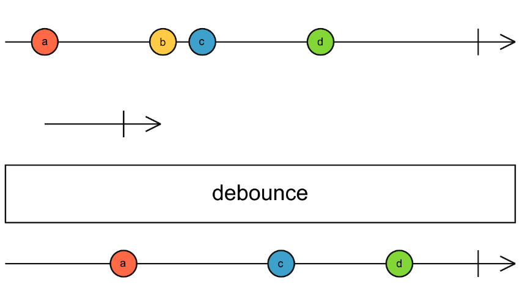

Es como `delay`, pero emite únicamente el valor más reciente de una sucesión de emisiones.
`debounceTime()` retrasa los valores del Observable fuente, eliminando las emisiones almacenadas pendientes de ser emitidas si el Observable fuente emite algún valor. Este operador almacena el valor más reciente del Observable fuente, y lo emite solo si ha pasado un periodo de tiempo, indicado por `dueTime`, sin que el Observable fuente emita ningún valor. Si el Observable fuente emite un valor antes de que pase el periodo de tiempo `dueTime`, el valor almacenado será eliminado, y nunca se emitirá en el Observable resultante.

Este es un operador de limitación de emisiones, ya que es imposible que se emita más de un valor en cualquiera de las ventanas de tiempo de duración `dueTime`, pero también es un operador similar a `delay`, ya que las emisiones de salida no ocurren en el mismo momento en el que se emitieron en el Observable fuente.

Recibe un `SchedulerLike` opcional para manejar los temporizadores.

La nomenclatura del operador sería `debounceTime<T>(dueTime: number, scheduler: SchedulerLike = async): MonoTypeOperatorFunction<T>` donde

* **dueTime:** La duración, en milisegundos (o en la unidad de tiempo determinada por el planificador opcional), del periodo de tiempo que debe pasar sin que el Observable fuente emita ningún valor, para poder emitir el valor más reciente de dicho Observable.

* **scheduler:** Opcional. El valor por defecto es `async`. El `SchedulerLike` que utilizar para gestionar los temporizadores que manejan el timeout para cada valor.

* **MonoTypeOperatorFunction<T>:** Un Observable que retrasa la emisiones del Observable fuente en un periodo de tiempo especificado por `dueTime`. Es posible que algunos valores sean eliminados si se emiten con demasiada frecuencia.

Su firma sería `takeUntil<T>(notifier: Observable<any>): MonoTypeOperatorFunction<T>`

Un buen ejemplo sería Emitir la tecla pulsada más reciente, tras una sucesión rápida de teclas. Por ejemplo, si escribimos 'RxJS mola' muy rápidamente (con menos de 500ms entre pulsaciones), solo se emitirá la última letra (a)

```ts
import { debounceTime } from "rxjs/operators";
import { fromEvent } from "rxjs";

const key$ = fromEvent<KeyboardEvent>(document, "keydown");

key$.pipe(debounceTime(500)).subscribe(({ code }) => console.log(code));
// Salida: KeyE
```

Emitir la posición del último click tras una sucesión rápida de clicks

```ts
import { debounceTime } from "rxjs/operators";
import { fromEvent } from "rxjs";

const click$ = fromEvent<MouseEvent>(document, "click");

click$
  .pipe(debounceTime(1000))
  .subscribe(({ screenX, screenY }) =>
    console.log(
      `Tu último click fue en la posición x: ${screenX}, y: ${screenY}`
    )
  );
// Salida: Tu último click fue en la posición x: 1278 , y: 265
```

Emite el click más reciente tras una sucesión de clicks

```ts
import { fromEvent } from "rxjs";
import { debounceTime } from "rxjs/operators";

const clicks = fromEvent(document, "click");
const result = clicks.pipe(debounceTime(1000));
result.subscribe((x) => console.log(x));
```

### throttleTime()
El operador `throttleTime()` Emite un valor del Observable fuente e ignora las emisiones siguientes durante un periodo de tiempo determinado. Después, repite el proceso

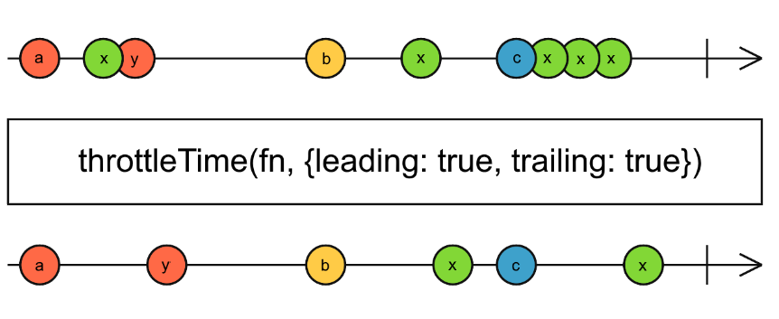

`throttleTime()` emite los valores del Observable fuente mientras su temporizador interno está deshabilitado, y los ignora mientras su temporizador está habilitado. Inicialmente, el temporizador está deshablitado. En cuanto se recibe el primer valor de la fuente, este se emite en el Observable resultante y se habilita e temporizador. Tras `duration` milisegundos (o la unidad temporal determinada internamente por el planificador opcional) se deshabilita el temporizador y se repite el proceso para el siguiente valor de la fuente. Opcionalmente, recibe un SchedulerLike para gestionar los temporizadores.

La nomenclatura del operador sería `throttleTime<T>(duration: number, scheduler: SchedulerLike = async, config: ThrottleConfig = defaultThrottleConfig): MonoTypeOperatorFunction<T>` donde

* **duration:** El periodo de tiempo que debe pasar antes de emitir el siguiente valor, a partir de la última emisión, en milisegundos o en la unidad de tiempo determinada por el planificador opcional.

* **scheduler:** Opcional. El valor por defecto es `async`. El `SchedulerLike` que utilizar para gestionar los temporizadores que se encargan de regular las emisiones.

* **config:** Opcional. El valor por defecto es `defaultThrottleConfig`. Un objeto de configuración para definir el comportamiento de los parámetros `leading` y `trailing`. Por defecto es `{ leading: true, trailing: false}.`

* **MonoTypeOperatorFunction<T>:** Un Observable that performs the throttle operation to limit the rate of emissions from the source.

Su firma sería `throttleTime<T>(duration: number, scheduler: SchedulerLike = async, config: ThrottleConfig = defaultThrottleConfig): MonoTypeOperatorFunction<T>`

Un buen ejemplo sería Emitir la tecla pulsada, ignorar todos los valores siguientes durante 2 segundos, y repetir

```ts
import { throttleTime } from "rxjs/operators";
import { fromEvent } from "rxjs";

const key$ = fromEvent<KeyboardEvent>(document, "keydown");

key$.pipe(throttleTime(2000)).subscribe(({ code }) => console.log(code));
// Salida: KeyX (2s) KeyO...
```

Emitir un valor, ignorar todos los valores durante 2 segundos, y repetir

```ts
import { map, throttleTime } from "rxjs/operators";
import { interval, zip, from } from "rxjs";

// El Observable fruit$ emite una fruta cada segundo
const fruit$ = zip(
  from(["Fresa", "Cereza", "Arándano", "Mora", "Frambuesa", "Grosella"]),
  interval(1000)
).pipe(map(([fruit]) => fruit));

fruit$.pipe(throttleTime(2000)).subscribe(console.log);
// Salida: Fresa, Mora
```

Emite como mucho un click por segundo

```ts
import { fromEvent } from "rxjs";
import { throttleTime } from "rxjs/operators";

const clicks = fromEvent(document, "click");
const result = clicks.pipe(throttleTime(1000));
result.subscribe((x) => console.log(x));
```

Doble Click

Emitir clicks que ocurran en los 400ms siguientes al click previo. De esta manera, se detecta el doble click. Hace uso del parámetro de configuración `trailing`.

```ts
import { fromEvent, asyncScheduler } from "rxjs";
import { throttleTime, withLatestFrom } from "rxjs/operators";

// defaultThottleConfig = { leading: true, trailing: false }
const throttleConfig = {
  leading: false,
  trailing: true,
};

const click = fromEvent(document, "click");
const doubleClick = click.pipe(
  throttleTime(400, asyncScheduler, throttleConfig)
);

doubleClick.subscribe((throttleValue: Event) => {
  console.log(`Doble-click! Timestamp: ${throttleValue.timeStamp}`);
});
```
Si se habilita el parámetro `leading` en este ejemplo, la salida sería el primer click y el doble click, pero se restringiría cualquier click adicional en un periodo de 400ms.

### sampleTime()
El operador `sampleTime()` Emite la emisión más reciente del Observable fuente en cada periodo de tiempo determinado

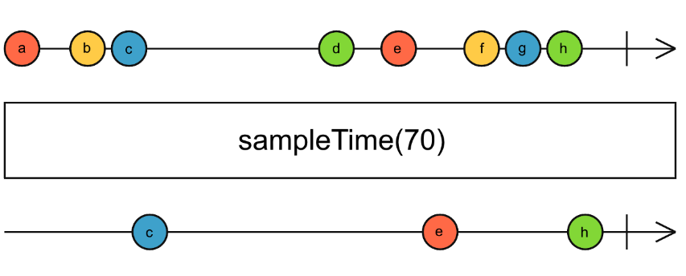

Toma una muestra del Observable fuente a intervalos periódicos de tiempo, emitiendo la emisión más reciente en dicho periodo de tiempo.

`sampleTime` emite la emisión más reciente del Observable fuente, desde el último muestreo, a no ser que la fuente no haya emitido nada desde el último muestreo. El muestreo ocurre de forma periódica, cada `period` milisegundos (o la unidad de tiempo definida por el argumento opcional `scheduler`.) El muestreo comienza en cuando se realice la suscripción al Observable resultante.

La nomenclatura del operador sería `sampleTime<T>(period: number, scheduler: SchedulerLike = async): MonoTypeOperatorFunction<T>` donde

* **period:** El periodo de muestreo expresado en milisegundos o en la unidad de tiempo determinada por el planificador opcional

* **scheduler:** Opcional. El valor por defecto es `async`. El SchedulerLike que utilizar para gestionar los temporizadores que se encargan del muestreo.

* **MonoTypeOperatorFunction<T>:**  Un Observable que emite la emisión más reciente del Observable fuente en el intervalo de tiempo especificado.

Su firma sería `throttleTime<T>(duration: number, scheduler: SchedulerLike = async, config: ThrottleConfig = defaultThrottleConfig): MonoTypeOperatorFunction<T>`

Un buen ejemplo sería Emitir el valor más reciente desde el último muestreo, realizado cada 2 segundos

```ts
import { fromEvent, interval } from "rxjs";
import { sampleTime } from "rxjs/operators";

const number$ = interval(1000);

number$.pipe(sampleTime(2000)).subscribe(console.log);
// Salida: 0, 2, 4, 6, 8...
```

Emitir la tecla pulsada más reciente desde el último muestreo, realizado cada 2 segundos

```ts
import { fromEvent } from "rxjs";
import { map, sampleTime } from "rxjs/operators";

const key$ = fromEvent<KeyboardEvent>(document, "keydown");

key$
  .pipe(
    sampleTime(2000),
    map(({ code }) => code)
  )
  .subscribe((code) =>
    console.log(`La tecla pulsada más reciente es: ${code}`)
  );
// Salida: (Pulsar tecla y) (Pulsar tecla x) La tecla pulsada más reciente es: KeyX
```

Cada segundo, emitir el click más reciente

```ts
import { fromEvent } from "rxjs";
import { sampleTime } from "rxjs/operators";

const clicks = fromEvent(document, "click");
const result = clicks.pipe(sampleTime(1000));
result.subscribe((x) => console.log(x));
```

### sample()
El operador `sample()` Emite la emisión más reciente del Observable fuente cuando un segundo Observable, el notificador, emite un valor

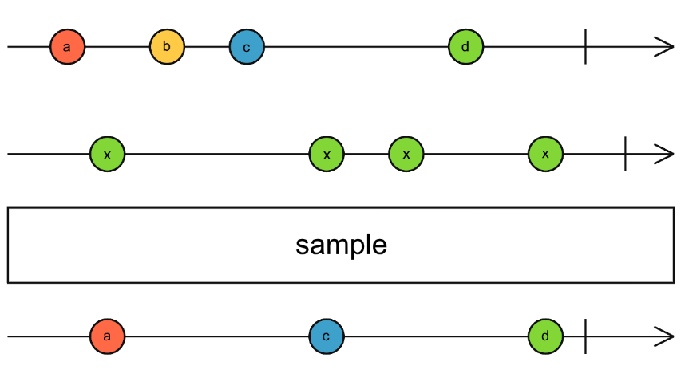

Es como `sampleTime`, pero toma una muestra del Observable fuente cuando el Observable notificador emite un valor.

Cuando el Observable `notifier` emite un valor o se completa, `sample` toma una muestra del Observable fuente y emite la emisión más reciente desde el último muestreo, a no ser que la fuente no haya emitido nada desde el último muestreo. En cuanto se lleve a cabo la suscripción al Observable resultante, también se realizará la del Observable `notifier`.

La nomenclatura del operador sería `sample<T>(notifier: Observable<any>): MonoTypeOperatorFunction<T>` donde

* **notifier:** El Observable que indica cuándo emitir el valor más reciente del Observable fuente.

* **MonoTypeOperatorFunction<T>:**  Un Observable que emite el valor más reciente del Observable fuente cuando el Observable notifier emite un valor o se completa.

Su firma sería `throttleTime<T>(duration: number, scheduler: SchedulerLike = async, config: ThrottleConfig = defaultThrottleConfig): MonoTypeOperatorFunction<T>`

Un buen ejemplo sería Emitir el valor más reciente desde el último muestreo, realizado cuando interval emite (cada 2s)

```ts
import { interval } from "rxjs";
import { sample } from "rxjs/operators";

const number$ = interval(1000);

number$.pipe(sample(interval(2000))).subscribe(console.log);
// Salida: 1, 3, 5, 7, 9...
```

Emitir el valor más reciente desde el último muestreo, realizado cada vez que se pulsa una tecla

```ts
import { fromEvent, interval } from "rxjs";
import { sample } from "rxjs/operators";

const number$ = interval(1000);
const key$ = fromEvent<KeyboardEvent>(document, "keydown");

number$
  .pipe(sample(key$))
  .subscribe((n) =>
    console.log(`El último valor emitido tras la última tecla pulsada es: ${n}`)
  );
// Salida: El último valor emitido tras la última tecla pulsada es: n
```

Con cada click, realizar un muestreo del temporizador seconds

```ts
import { fromEvent, interval } from "rxjs";
import { sample } from "rxjs/operators";

const seconds = interval(1000);
const clicks = fromEvent(document, "click");
const result = seconds.pipe(sample(clicks));
result.subscribe((x) => console.log(x));
```

### auditTime()
El operador `auditTime()` Ignora los valores de la fuente durante un periodo de tiempo, tras el cual emite el valor más reciente del Observable fuente.

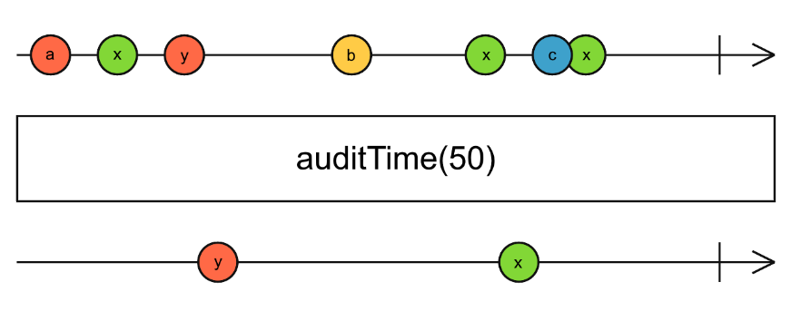

Cuando recibe un valor de la fuente, lo ignora, además de todos los valores posteriores durante un periodo de tiempo. Una vez finalizado el periodo de tiempo, emite el valor más reciente del Observable fuente.

`auditTime` es similar a throttleTime, pero emite el último valor del periodo de silenciamiento, en lugar del primero. auditTime emite el valor más reciente del Observable fuente en cuanto su temporizador interno se deshabilita, e ignora los valores de la fuente mientras el temporizador está habilitado. Inicialmente, el temporizador está deshabilitado. En cuanto llega el primer valor de la fuente, se habilita el temporizador. Tras un periodo de tiempo, determinado por `duration`, se deshabilita el temporizador y se emite el valor más reciente que haya emitido la fuente, en el Observable resultante. Este proceso se repite con cada valor de la fuente. auditTime puede recibir un SchedulerLike opcional para gestionar los temporizadores.

La nomenclatura del operador sería `auditTime<T>(duration: number, scheduler: SchedulerLike = async): MonoTypeOperatorFunction<T>` donde

* **duration:** El tiempo que se debe esperar antes de emitir el valor más reciente de la fuente, medido en milisegundos o en la unidad de tiempo determinada por el planificador opcional.

* **scheduler:** 	Opcional. El valor por defecto es async. El SchedulerLike que utilizar para gestionar los temporizadores que se encargan del comportamiento de limitación de emisiones.

* **MonoTypeOperatorFunction<T>:**  Un Observable que limita las emisiones del Observable fuente.

Su firma sería `auditTime<T>(duration: number, scheduler: SchedulerLike = async): MonoTypeOperatorFunction<T>`

Un buen ejemplo sería Ignorar las teclas pulsadas durante un periodo de 2s, tras el cual emitir la última tecla pulsada. Repetir.

```ts
import { auditTime } from "rxjs/operators";
import { fromEvent } from "rxjs";

const key$ = fromEvent<KeyboardEvent>(document, "keydown");

key$.pipe(auditTime(2000)).subscribe(({ code }) => console.log(code));
// Salida: (2s) KeyX (2s) KeyO...
```

Emite como mucho un click por segundo

```ts
import { fromEvent } from "rxjs";
import { auditTime } from "rxjs/operators";

const clicks = fromEvent(document, "click");
const result = clicks.pipe(auditTime(1000));
result.subscribe((x) => console.log(x));
```

### catchError()
El operador `catchError()` Captura errores en el Observable que se manejan devolviendo un Observable nuevo o lanzando un error

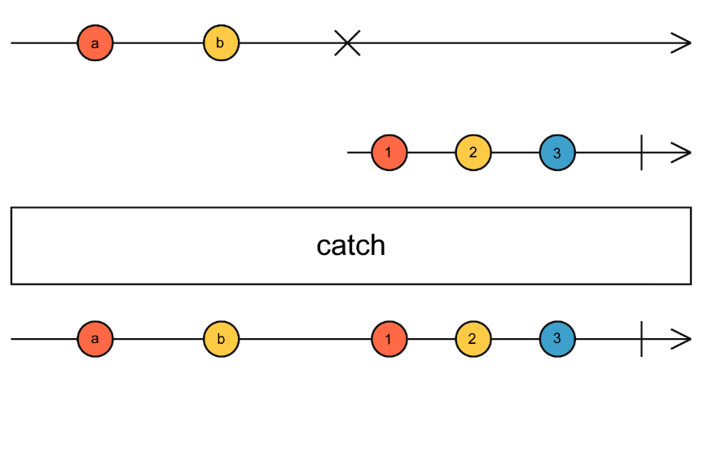

`catchError` captura errores en el Observable fuente, manejándolos de dos maneras posibles: bien devolviendo un Observable nuevo o bien lanzando un nuevo error.

La nomenclatura del operador sería `catchError<T, O extends ObservableInput<any>>(selector: (err: any, caught: Observable<T>) => O): OperatorFunction<T, T | ObservedValueOf<O>>` donde

* **selector:** Una función que recibe como argumentos err, que es el error, y `caught`, que es el Observable fuente, por si se quiere "reiniciar" el Observable devolviéndolo otra vez. El Observable que se retorne por el selector es el que se utilizará para continuar la cadena Observable.


* **OperatorFunction<T, T | ObservedValueOf<O>>:**  Un Observable que se puede originar en el Observable fuente o en el Observable retornado por la función selector.

Su firma sería `auditTime<T>(duration: number, scheduler: SchedulerLike = async): MonoTypeOperatorFunction<T>`

Un buen ejemplo sería Capturar un error, retornando un Observable

```ts
import { throwError, of } from "rxjs";
import { catchError } from "rxjs/operators";

const error$ = throwError("¡Oh no!");

error$
  .pipe(catchError((error) => of(`Error capturado grácilmente: ${error}`)))
  .subscribe(console.log);
// Salida: Error capturado grácilmente: ¡Oh no!
```

Capturar un error y lanzar otro error

```ts
import { throwError, of } from "rxjs";
import { catchError } from "rxjs/operators";

const error$ = throwError("Oh no!");

error$
  .pipe(
    catchError((error) => {
      throw `Lanzando un nuevo error: ${error}`;
    })
  )
  .subscribe(console.log, console.error);
// Salida: (Error) Lanzando un nuevo error: Oh no!
```

Capturar los errores de un Observable interno

Al capturar los errores que ocurren en un Observable interno (un Observable emitido por un Observable de orden superior), se debe tener cuidado a la hora de utilizar el operador catchError ya que, si se coloca en el sitio equivocado, el flujo del Observable fuente no seguirá ejecutándose tras capturar el error.

A continuación, se puede ver cómo el uso incorrecto de catchError hará que, después de capturar el error que devuelve la primera petición, el flujo se completará y no se harán las otras dos peticiones restantes:

```ts
import { map, concatMap, catchError } from "rxjs/operators";
import { ajax } from "rxjs/ajax";
import { of } from "rxjs";

const pokemonId$ = of(-3, 5, 6);

function getPokemonName(id: number) {
  return ajax
    .getJSON(`https://pokeapi.co/api/v2/pokemon/${id}`)
    .pipe(map(({ name }) => name));
}

pokemonId$
  .pipe(
    concatMap((id) => getPokemonName(id)),
    catchError((error) => of(`¡Oh no, ha ocurrido un error! ${error}`))
  )
  .subscribe(console.log, console.error, () => console.log("Completado"));
// Salida: ¡Oh no, ha ocurrido un error! AjaxError: ajax error 404, Completado
```

Sin embargo, si se utiliza catchError en el Observable interno, el comportamiento es el que se busca: cuando falle la primera petición, se capturará el error y el flujo seguirá ejecutándose, realizando las dos peticiones restantes:

```ts
import { map, concatMap, catchError } from "rxjs/operators";
import { ajax } from "rxjs/ajax";
import { of } from "rxjs";

const pokemonId$ = of(-3, 5, 6);

function getPokemonName(id: number) {
  return ajax
    .getJSON(`https://pokeapi.co/api/v2/pokemon/${id}`)
    .pipe(map(({ name }) => name));
}

pokemonId$
  .pipe(
    concatMap((id) =>
      getPokemonName(id).pipe(catchError((error) => of(`¡Oh no! ${error}`)))
    )
  )
  .subscribe(console.log, console.error, () => console.log("Completado"));
// Salida: ¡Oh no, ha ocurrido un error!, charmeleon, charizard, Completado
```

Continuar con un Observable diferente cuando ocurre un error

```ts
import { of } from "rxjs";
import { map, catchError } from "rxjs/operators";

of(1, 2, 3, 4, 5)
  .pipe(
    map((n) => {
      if (n === 4) {
        throw "four!";
      }
      return n;
    }),
    catchError((err) => of("I", "II", "III", "IV", "V"))
  )
  .subscribe((x) => console.log(x));
// 1, 2, 3, I, II, III, IV, V
```

Reiniciar el Observable fuente en caso de error, parecido al operador retry()

```ts
import { of } from "rxjs";
import { map, catchError, take } from "rxjs/operators";

of(1, 2, 3, 4, 5)
  .pipe(
    map((n) => {
      if (n === 4) {
        throw "four!";
      }
      return n;
    }),
    catchError((err, caught) => caught),
    take(30)
  )
  .subscribe((x) => console.log(x));
// 1, 2, 3, 1, 2, 3...
```

Lanzar un error nuevo cuando el Observable fuente lance un error

```ts
import { of } from "rxjs";
import { map, catchError } from "rxjs/operators";

of(1, 2, 3, 4, 5)
  .pipe(
    map((n) => {
      if (n === 4) {
        throw "four!";
      }
      return n;
    }),
    catchError((err) => {
      throw "error en la fuente. Detalles: " + err;
    })
  )
  .subscribe(
    (x) => console.log(x),
    (err) => console.log(err)
  );
// 1, 2, 3, error en la fuente. Detalles: four!
```
