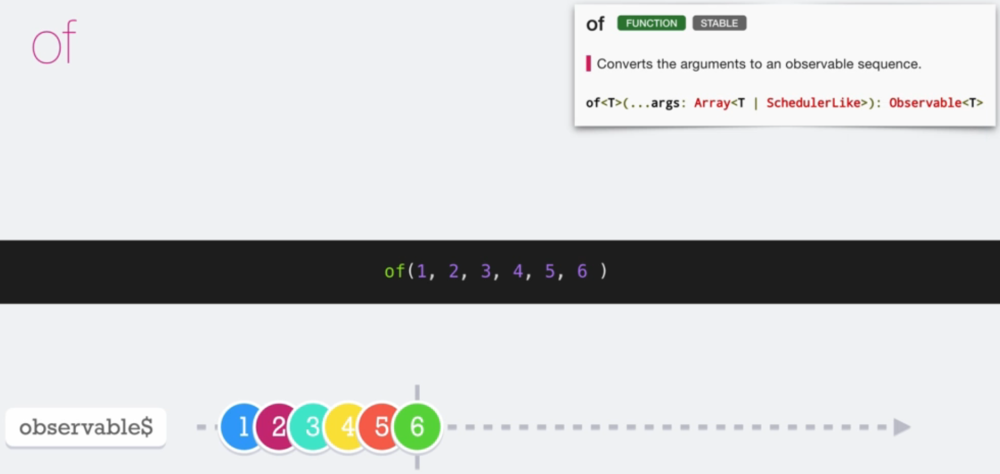
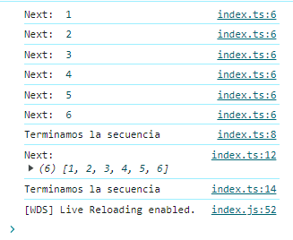
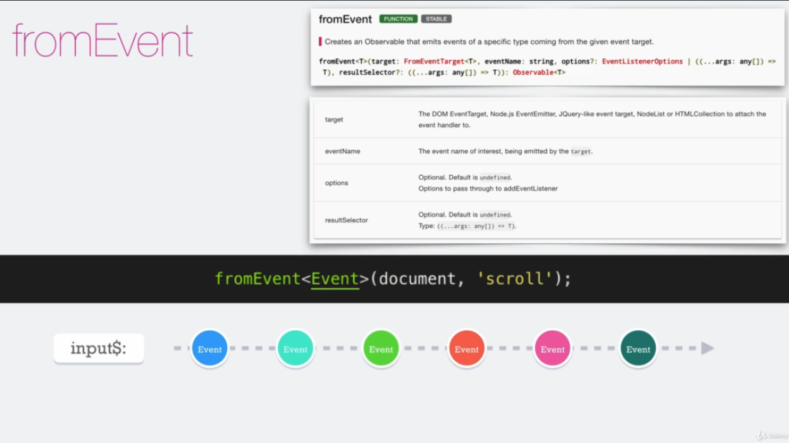
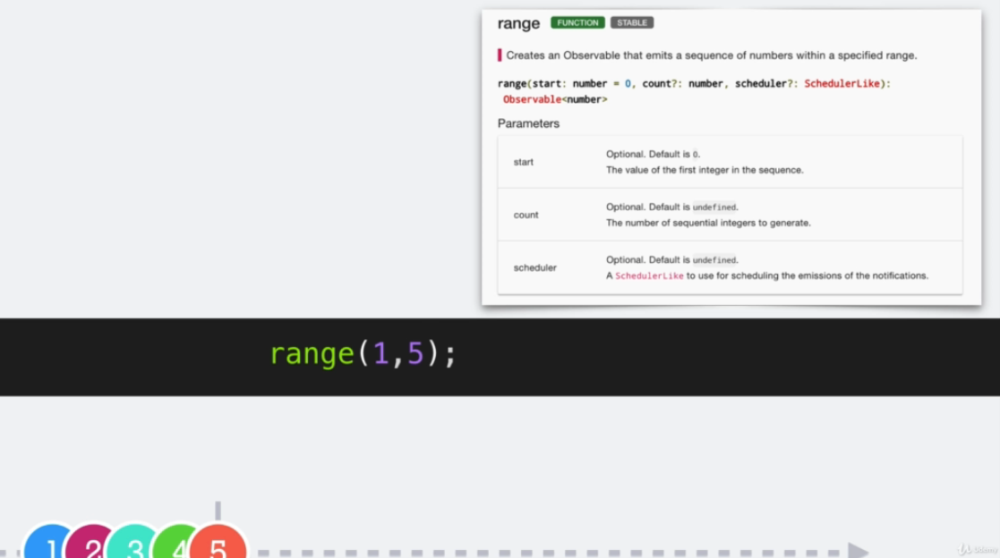
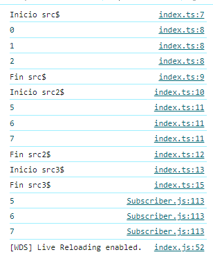
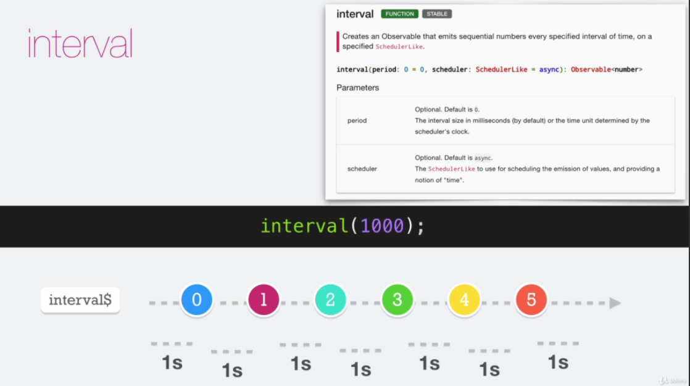
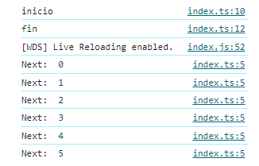
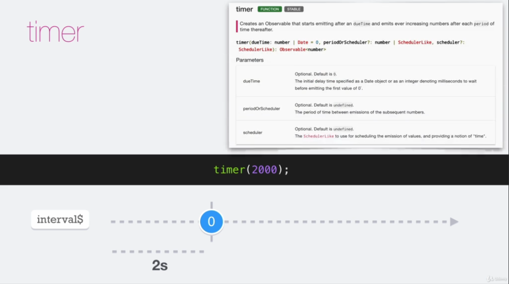
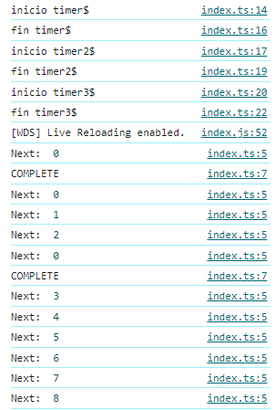

# Curso ReactiveX

* [¿Qué es la programación reactiva?](#qué-es-la-programación-reactiva)
* [¿Qué es ReactiveX?](#que-es-reactive)
* [¿Qué es RxJS?](#qué-es-rxjs)
* [¿Cuándo usar Rx?](#cuándo-usar-rx)
* [Observables](#observables)    
    * [Observer](#observer)
    * [observables.next()](#observablesnext)
    * [observables.error()](#observableserror)
    * [observables.complete()](#observablescomplete)
    * [Subject](#subject)
    * [Cold Observable vs Hot Observable](#cold-observable-vs-hot-observable)
    * [of()](#of)
    * [fromEvent()](#fromevent)
    * [range()](#range)
    * [interval()](#interval)
    * [timer()](#timer)
    * [Buenas prácticas con Observables](#buenas-prácticas-con-observables)
* [Subscribers](#subscribers)
    * [PartialObserver](#partialobserver)
    * [unsubscribe()](#unsubscribe)
* [Operators](#operators)    
    * [ngOnChanges](#ngonchanges)


## ¿Qué es la programación reactiva?
Es un paradigma de la programación declarativa funcional relacionada con el tratamiento de flujos de datos (data streams) y la propagación de los cambios.

## ¿Qué es ReactiveX?
ReactiveX es una biblioteca de software creada originalmente por Microsoft que permite que los lenguajes de programación imperativos operen en secuencias de datos sin importar si los datos son sincrónicos o asincrónicos.


## ¿Qué es RxJS?
RxJS es la adaptación a JS (JavaScript) del conjunto de herramientas de ReactiveX, está desarrollada para diversos lenguajes como C++ (RxCpp), C# (Rx.NET), o PHP (RxPHP) entre otros.

## ¿Cuándo usar Rx?
* Al momento de manejar eventos de la interfaz de usuario
* Cuando es necesario notificar sobre cambios de uno o varios objetos
* Comunicación por Sockets
* Cuando necesitamos trabajar con flujos de información **(Streams)**

## Observables
Son la pieza fundamental de las extensiones reactivas. En lugar de manejar los eventos de manera imperativa, los `Observables` ofrecen una forma declarativa de tratar con secuencias de eventos y datos asíncronos. Entre sus características principales tenemos:
* Son la fuente de información.
* Pueden emitir múltiples valores, sólo uno o ninguno.
* Pueden emitir errores.
* Pueden ser finitos o infinitos.
* Pueden ser síncronos o asíncronos.


Un observable tiene la capacidad de emitir o no un valor, para instanciar un observable basta con importar la librería e iniciarlo con el método `create` o con `new Observable<tipo_de_dato>()`, en TS en caso de no colocar el tipo de dato, el lenguaje interpretará que es de tipo `any`
```ts
import { Observable } from "rxjs";

// const obs$ = Observable.create();
const obs$ = new Observable<string>();
```
> **Nota**: el método `create` se encuentra deprecated desde la v7 de rxjs y sera eliminado en la v8.

### Observer
Un `Observer` o `Observador` es aquel que se subscribe a un `Observable`. Este observador reaccionará a cualquier elemento o secuencia de elementos que emita el Observable.

### observables.next()
Las notificaciones "Next" son las más importantes, y las más comunes ya que representan los datos que se envían al suscriptor. Las mismas deben ser del tipo de dato indicado en caso de trabajar con un lenguaje de tipado o puede ser nulas.

```ts
import { Observable } from "rxjs";

// const obs$ = Observable.create();
const obs$ = new Observable(subs => {
    subs.next('test');
    subs.next('hola');
});

obs$.subscribe(console.log);
```

### observables.error()
El método `error()` no es más que un controlador para notificar de un error. Un error detiene la ejecución de la instancia observable y cancela la suscripción.

```ts
import { Observable } from "rxjs";
const obs$ = new Observable<string>(subs => {
    // Forzando un error
    const a = undefined;
    a.nombre = 'Fernando'
    console.log('1');
    subs.complete();
});

obs$.subscribe({ 
    next: next => console.log('Next: ', next), 
    error: error => console.warn('Error: ', error), 
    complete: () => console.log('COMPLETE')
});

```
En este ejemplo forzamos un error donde se mostrará por consola el siguiente mensaje


### observables.complete()
El método `complete()` no es más que un controlador para notifica que la ejecución fue completada.

```ts
import { Observable } from "rxjs";

// const obs$ = Observable.create();
const obs$ = new Observable(subs => {
    subs.next('test');
    subs.next('hola');
    subs.complete();
});

obs$.subscribe(console.log);

```
Una vez colocado aunque se emitan valores los mismos no llegarían a sus subscriptores. En el ejemplo de a continuación los valores test y hola se emite, pero los número 2 y 3 no lo harán

```ts
import { Observable } from "rxjs";

// const obs$ = Observable.create();
const obs$ = new Observable(subs => {
    subs.next('test');
    subs.next('hola');
    subs.complete();
    subs.next('2');
    subs.next('3');
});

obs$.subscribe(console.log);
```

### Subject
Un `Subject` es una especie de puente entre los observables (emisores) y los Observers (suscriptores) de un flujo de datos. Tiene las caracteristicas de:
* Permite el casto múltiple.
* Es un observer
* Tiene las propiedades Next, Error y Complete

Un `Subject` es, en sí mismo, un observable que puede emitir valores, pero también es un objeto que puede ser utilizado para suscribirse a los eventos emitidos. 
```ts
import { Observable, Observer, Subject, Subscription } from "rxjs";

const intervalo$ = new Observable<number>(subs => {
    const intrv = setInterval(() => { subs.next(Math.random()) }, 1000)
    return () => {
        clearInterval(intrv);
        console.log('completado');        
    }
})

const subsject$ = new Subject();

const subsjectSubject$ = intervalo$.subscribe(subsject$);

const subs1 = subsject$.subscribe(console.log);
const subs2 = subsject$.subscribe(console.log);

setTimeout(() => {
    subsject$.next(10);
    subsject$.complete();
    subsjectSubject$.unsubscribe();
}, 3500);
```

En este ejemplo nos estámos subscribiendo al observable `intervalo$` y emitimos valores con `subsject$.next(10);`

### Cold Observable vs Hot Observable
Cuando la data es producida por el observable en sí mismo, es considerado un `Cold Observable`. Pero cuando la data es producida fuera del observable es llamado `Hot Observable`

```ts
import { Observable, Observer, Subject, Subscription } from "rxjs";

const intervalo$ = new Observable<number>(subs => {
    const intrv = setInterval(() => { subs.next(Math.random()) }, 1000)
    return () => {clearInterval(intrv)}
})

const subsject$ = new Subject();

intervalo$.subscribe(subsject$);

const subs1 = subsject$.subscribe(console.log);
const subs2 = subsject$.subscribe(console.log);

setTimeout(() => {
    subsject$.next(10);
    subsject$.complete();
}, 3500);
```
La respuesta por consola de este código por consola sería


Acá podemos apreciar un buen ejemplo del `Hot Observable` ya que logramos insertar información al usando el `subsject$.next(10)` al flujo de datos que el observable `intervalo$` estaba emitiendo.


### of()
El operador `of()` es una función que toma como parámetro una secuencia de elementos y devuelve un observable que emite cada elemento de la secuencia tal cual como se recibió, tiene la particularidad que emite sincrónicamente los argumentos descritos y luego se completa inmediatamente.



Es importante tomar en consideración que los valores enviamos deben estar separados por comas (,) a fin que detecte que son elementos diferentes. La nomenclatura usada sería `of<tipo-valor>(valor1, valor2, valor3);`
```ts
import { of } from "rxjs";

const obs$ = of(1,2,3,4,5,6);

obs$.subscribe({
    next: next => console.log('Next: ', next),
    error: error => console.warn('Error: ', error),
    complete: () => console.log('Terminamos la secuencia')
})

const obs2$ = of([1,2,3,4,5,6]);

obs2$.subscribe({
    next: next => console.log('Next: ', next),
    error: error => console.warn('Error: ', error),
    complete: () => console.log('Terminamos la secuencia')
})
```
En el anterior ejemplo vemos como `obs$` responde con 6 diferentes elementos númericos mientras que `obs2$` nos responde un solo elemento de tipo array




### fromEvent()
El operador `fromEvent()` es una función que crea un Observable que emite eventos de un tipo específico, originados en el *event target* proporcionado. Un *event target* es un objeto con métodos para registrar las funciones de manejo de eventos.



Un ejemplo del uso del `fromEvent` es cuando deseamos escuchar eventos propios del DOM, en este caso escucharemos los eventos del `click` y del `keyup`.
La nomenclatura usada sería `fromEvent<tipo-valor>(target, eventName);`

```ts
import { Observer, fromEvent } from "rxjs";

const src1$ = fromEvent<PointerEvent>( document, 'click');
const src2$ = fromEvent<KeyboardEvent>( document, 'keyup');

const observer: Observer<any> = {
    next: next => console.log('Next: ', next),
    error: error => console.warn('Error: ', error),
    complete: () => console.log('Terminamos la secuencia')
}

src1$.subscribe(observer);
src2$.subscribe(event => {
    console.log(event.key);
});
```

### range()
La función `range()` crea un Observable que emite una secuencia de números dentro de un rango. Por default esta función es sincrona



La función `range()` posee la siguiente nomenclatura `range(start: number, count?: number, scheduler?: SchedulerLike): Observable<number>`, donde si solo se coloca un valor indicará la cantidad de emisiones iniciando en el `valor 0`.
* **start:** El valor del primer número entero de la secuencia.
* **count:** El número de enteros secuenciales que se generarán.
* **scheduler:** Es un SchedulerLike que se utiliza para programar las emisiones de las notificaciones. Esto puede permitir modificar la función de sincrona a asincrona

```ts
import { asyncScheduler, range } from "rxjs";

const src$ = range(3);
const src2$ = range(5,3);
const src3$ = range(5,3, asyncScheduler);

console.log('Inicio src$');
src$.subscribe(console.log)
console.log('Fin src$');


console.log('Inicio src2$');
src2$.subscribe(console.log)
console.log('Fin src2$');

console.log('Inicio src3$');
src3$.subscribe(console.log)
console.log('Fin src3$');
```
La respuesta de este ejemplo daría




### interval()
La función `interval()` crea un Observable que emite una secuencia de números incremental, con el intervalo de tiempo entre emisiones que se especifique. Por default esta función es asincrona



La función `interval()` posee la siguiente nomenclatura `interval(period: number = 0, scheduler: SchedulerLike = async): Observable<number>`, 

* **period:** El valor por defecto es `0`. El tamaño del intervalo en milisegundos (por defecto) o en la unidad de tiempo determinada por el reloj del planificador.
* **scheduler:** Es un SchedulerLike, el valor por defecto es `async`. El SchedulerLike que se utiliza para planificar la emisión de valores y para proporcionar la noción del "tiempo".

```ts
import { Observer, interval } from "rxjs";

const observer: Observer<number> = {
    next: next => console.log('Next: ', next),
    error: error => console.warn('Error: ', error),
    complete: () => console.log('COMPLETE')
}

const interval$ = interval(1000);

console.log('inicio');
interval$.subscribe(observer)
console.log('fin');
```
La respuesta de este ejemplo daría




### timer()
La función `timer()` crea un Observable que comienza a emitir una secuencia ascendente de números consecutivos a intervalos, tras un periodo inicial de tiempo. Por default esta función es asincrona



La función `timer()` posee la siguiente nomenclatura `timer(dueTime: number | Date = 0, periodOrScheduler?: number | SchedulerLike, scheduler?: SchedulerLike): Observable<number>`, 

* **dueTime:** El valor por defecto es `0`. El valor del retraso inicial que esperar antes de emitir el primer valor, especificado como objeto Date o como Integer, en milisegundos.
* **periodOrScheduler:** El valor por defecto es `undefined`. El periodo de tiempo entre emisiones.
* **scheduler:** Es un SchedulerLike, El valor por defecto es `undefined`. EL SchedulerLike que utilizar para planificar las emisiones, proporcionando la noción de 'tiempo'.

```ts
import { Observer, timer } from "rxjs";

const observer: Observer<number> = {
    next: next => console.log('Next: ', next),
    error: error => console.warn('Error: ', error),
    complete: () => console.log('COMPLETE')
}

const timer$ = timer(2000);
const timer2$ = timer(3000, 1000);

const today = new Date();
today.setSeconds(today.getSeconds() + 6)

const timer3$ = timer(today);


console.log('inicio timer$');
timer$.subscribe(observer)
console.log('fin timer$');

console.log('inicio timer2$');
timer2$.subscribe(observer)
console.log('fin timer2$');

console.log('inicio timer3$');
timer3$.subscribe(observer)
console.log('fin timer3$');
```

La respuesta de este ejemplo daría



Como se puede apreciar en el `timer$` fue completado al pasar 2 segundos, por su parte el `timer2$` empezó a generar intervalos de tiempo a partir de los 3 segundos cada 1 seg, por último el timer3$ realizó su única ejecución a los 6 segundos y completo instantaneamente.

### Buenas prácticas con Observables
* **Nomenclatura de variables:** Es recomendable identificar un `Observable` con una variable la cual lleve al final de la misma un simbolo de dolar, por ejemplo **`clicks$`**.
* **Utiliza tipado fuerte:** Es recomendable especificar el tipo de datos emitidos por el Observable utilizando tipos fuertemente tipados.
* **Evita la creación innecesaria de Observables:** En lugar de crear nuevos Observables para cada operación, intenta encadenar operadores en un solo Observable utilizando tuberías (pipes). 
* **Utiliza el operador `pipe`:** El operador pipe permite encadenar múltiples operadores para transformar, filtrar o combinar los datos emitidos por el Observable.
* **Desuscribe adecuadamente:** Si te suscribes a un Observable, asegúrate de desuscribirte cuando ya no necesites recibir más datos.
* **Evita el uso de `any`:** En la medida de lo posible, evita utilizar el tipo any para los datos emitidos por los Observables.
* **Utiliza operadores de error:** Los Observables proporcionan operadores como `catchError` y `retry` para manejar errores de manera más robusta.
* **Separación de responsabilidades:** Separa las operaciones de los Observables en diferentes funciones o servicios.
* **Documenta tus Observables:** Añade comentarios o documentación que explique la finalidad y el comportamiento de los Observables que estás utilizando.


## Subscribers
Es un método para conectarte a un **[Observable](#observables)**. Entre sus características principales tenemos:
* Se subscriben a un observable, es decir están pendiente de lo que realiza un observable.
* Consumen / observan la data que proviene del observable
* Pueden recibir los errores y eventos del observable
* Desconocen todo lo que se encuentra detrás del observable, es decir, la data puede haber sido previamente filtrada por algún **Operador** pero ellos lo desconocerán.

Para subscribirse a un Observable basta con usar el método `subscribe`
```ts
import { Observable } from "rxjs";

const obs2$ = new Observable(subs => {
    subs.next('test');
    subs.next('hola');
    subs.complete();
    subs.next('2');
    subs.next('3');
});

obs2$.subscribe(res => console.log(res));
```
En este este ejemplo cada vez que un observable emita un valor será mostrado por consola, en vista que solo tiene una respuesta también se pudo escribir `obs2$.subscribe(console.log);`

Las subscriciones 


```ts
import { Observable } from "rxjs";

// const obs$ = Observable.create();
const obs$ = new Observable<string>(subs => {
    subs.next('test');
    subs.next('hola');

    // Forzando un error
    // const a = undefined;
    // a.nombre = 'Fernando'
    subs.complete();
});

obs$.subscribe({ 
    next: next => console.log('Next: ', next), 
    error: error => console.warn('Error: ', error), 
    complete: () => console.log('COMPLETE')
});

```

### PartialObserver
Las subscripciones reciben pueden recibir varios tipos de datos entre los que tenemos los `PartialObserver`, para usarlos basta con importar `Observer` de `rxjs` y colocar los flujos `next`, `error` y `complete`

```ts
import { Observable, Observer } from "rxjs";

const obs$ = new Observable<string>(subs => {
    subs.next('test');
    subs.next('hola');

    // Forzando un error
    // const a = undefined;
    // a.nombre = 'Fernando'
    subs.complete();
});

const observer: Observer<any> = {
    next: next => console.log('Next: ', next), 
    error: error => console.warn('Error: ', error), 
    complete: () => console.log('COMPLETE')
}

obs$.subscribe(observer);
```

### unsubscribe()
Es una función para liberar recursos o cancelar ejecuciones de un observable, basta con usar el método `unsubscribe()` posterior a la subscripción

```ts
import { Observable, Observer } from "rxjs";

const obs$ = new Observable<string>(subs => {
    subs.next('test');
    subs.next('hola');
    subs.complete();
});

const observer: Observer<any> = {
    next: next => console.log('Next: ', next), 
    error: error => console.warn('Error: ', error), 
    complete: () => console.log('COMPLETE')
}

const sub = obs$.subscribe(observer);
sub.unsubscribe();
```

> **Nota**: Que un recursos cancele la suscripción no implica necesariamente que el observable se detenga.

En caso de tener varias subscripciones y deseamos detenerlas todas en cadena podemos usar el método `add()` para añadir una suscripción a una variable global y posteriormente cancelar dicha suscripción.

```ts
import { Observable, Observer, Subscription } from "rxjs";

const observer: Observer<any> = {
    next: next => console.log('Next: ', next), 
    error: error => console.warn('Error: ', error), 
    complete: () => console.log('COMPLETE')
}

const intervalo$ = new Observable<number>( subs => {

    let count = 0
    // Crear un contador, 1, 2, 3, 4, 5, .....
    const int = setInterval ( () => {
        // cada segundo
        count++;
        subs.next(count)
    }, 1000)

    return () => {
        clearInterval(int);
        console.log('Intervalo destruido');
    }
})

const sub = intervalo$.subscribe (observer);
const sub2 = intervalo$.subscribe (observer);
const sub3 = intervalo$.subscribe (observer);

const allSubs = new Subscription()
allSubs.add(sub);
allSubs.add(sub2);
allSubs.add(sub3)

setTimeout(() => {
    allSubs.unsubscribe();
    console.log('Completado');    
}, 6000);

```

Este código retornará por consola. Demostrando como después del intervalo de los 6 segundos las suscripciones se detienen


## Operators
Los operadores son funciones que construyen sobre la fundación de los observables para tener una manipulación más sofisticada de las colecciones. Entre sus características principales tenemos:
* Usados para `transformar` Observables, por ejemplo tenemos (map, group, scan...)
* Usados para `filtrar` observables, por ejemplo tenemos (filter, distict, skip, debounce...)
* Se pueden usar para `combinar` observable.
* Se pueden usar para `crear` nuevos observable.